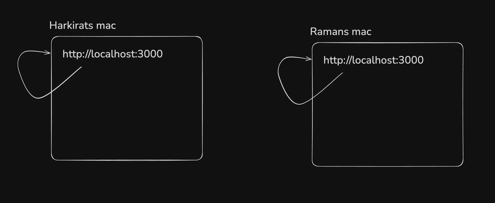
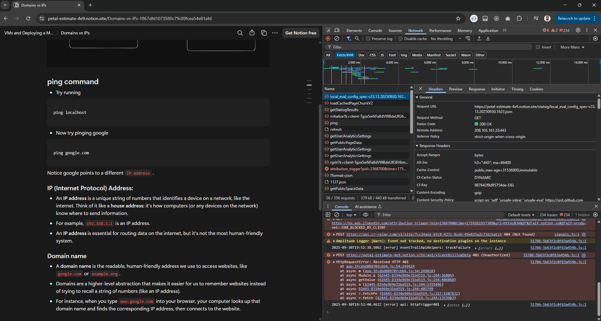
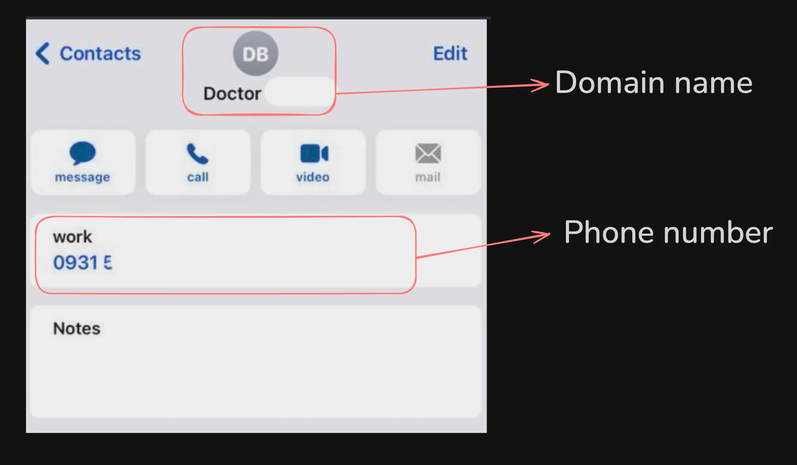
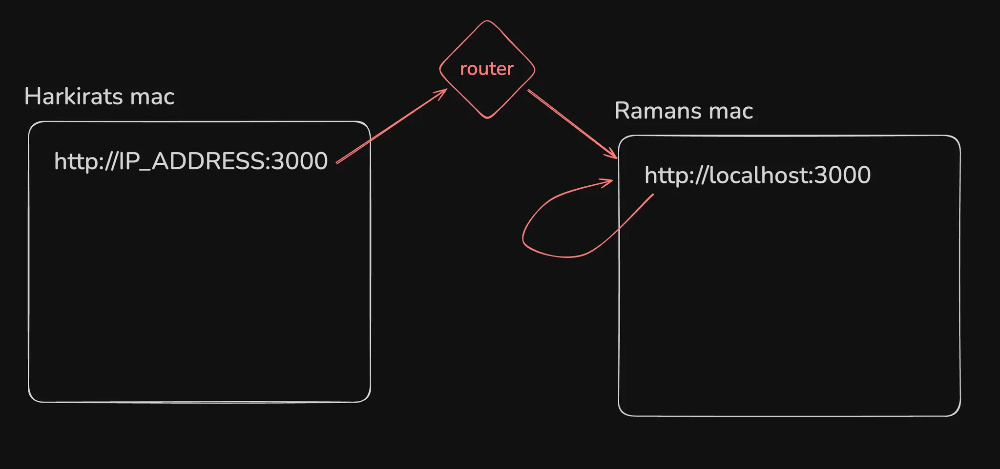
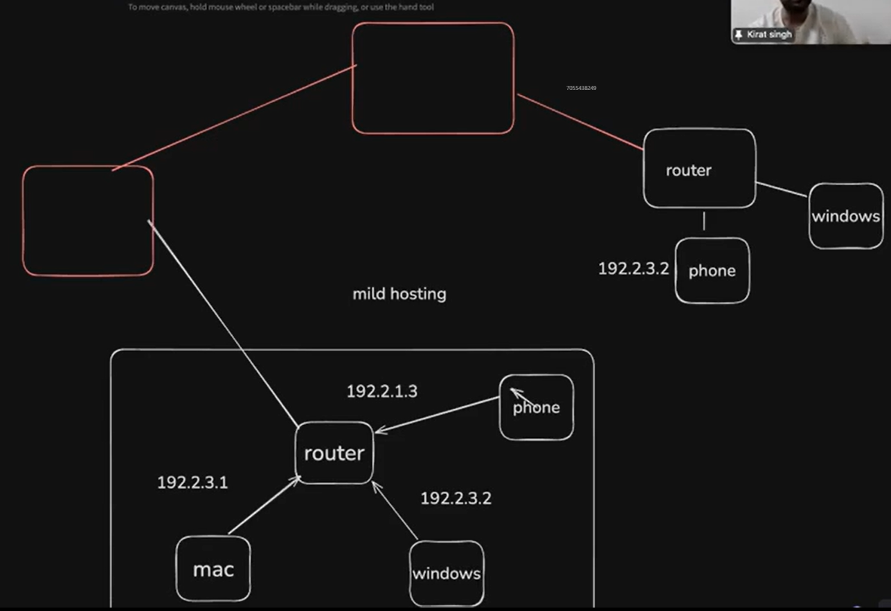
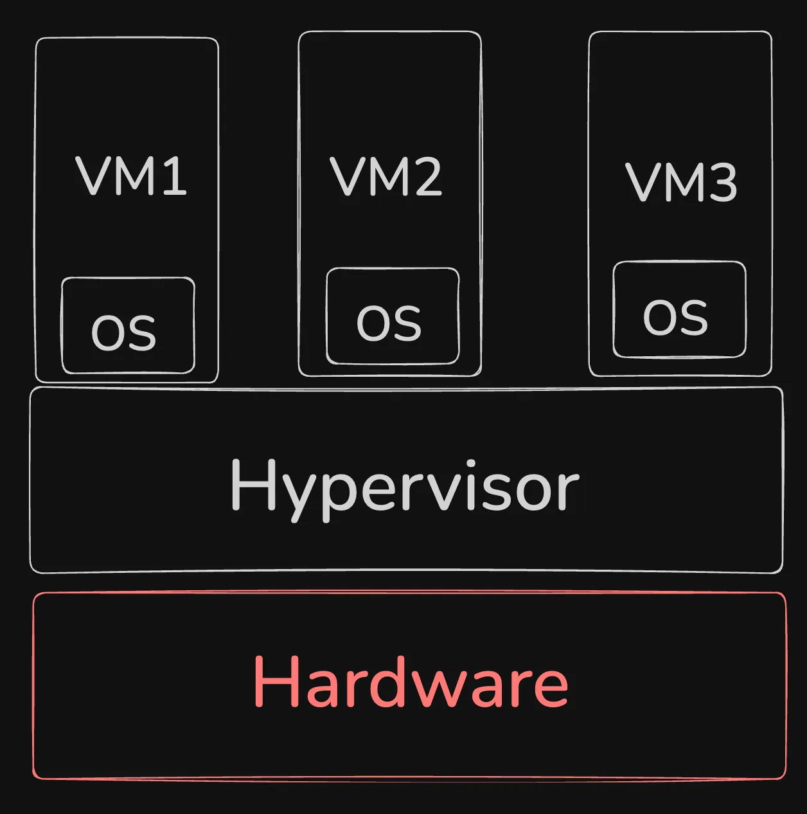
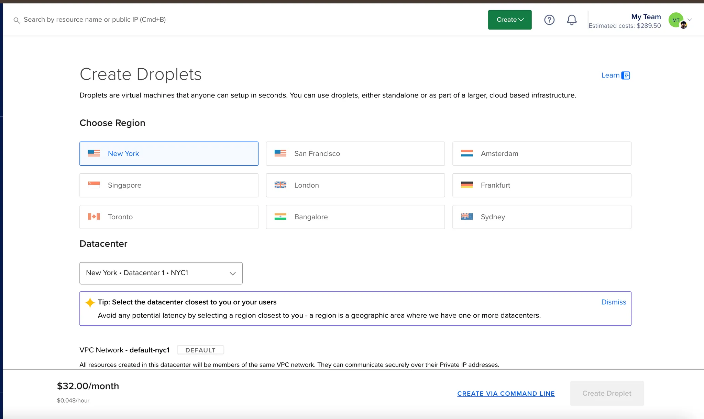
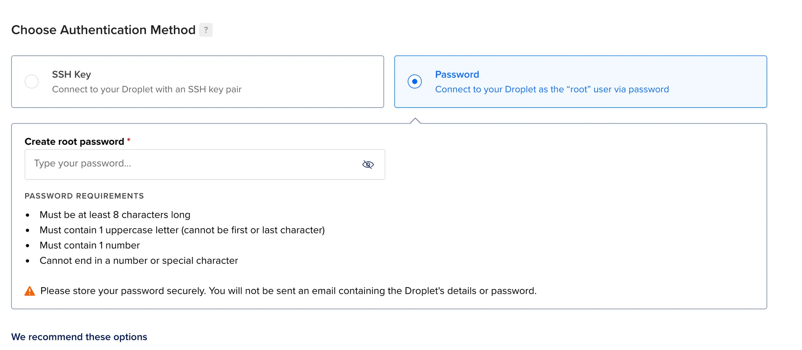
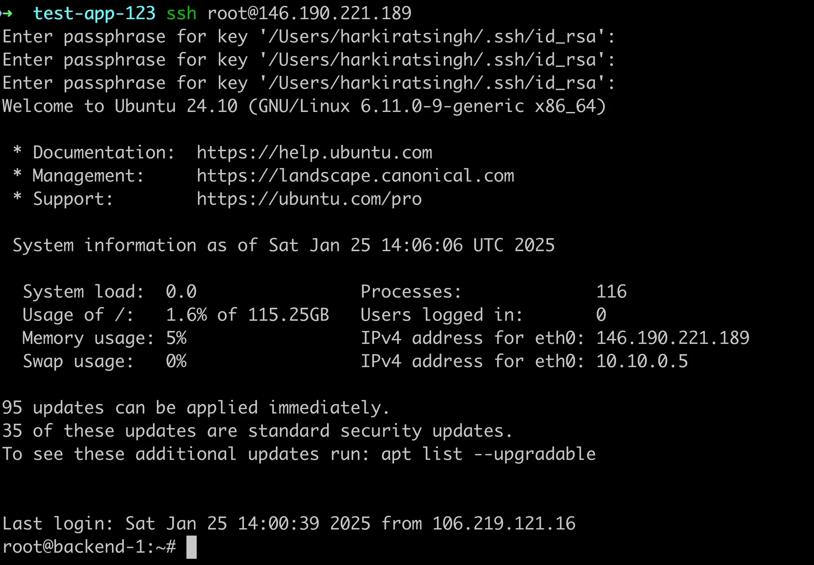

# Virtual Machines and Deploying a MERN App
## Why deploy on the internet localhost was not enough?
### Whats wrong in the following message? Is jimmy lying?

- Yes person with localhost cannot access the website.

# Domains vs IPs

## localhost
- "Localhost" refers to the computer you're currently working on. 
- It's essentially a loopback address that points to the machine itself, allowing it to communicate with itself over a network. 
- In technical terms, the IP address for localhost is usually `127.0.0.1` for IPv4, or `::1` for IPv6.
- localhost means pointing to your own machine.
 

## ping command
- Try running
```solidity
    ping localhost
```
- We have got the IP address -> IPv6 [::1]
```text
    C:\Users\Rohit's PC>ping localhost

    Pinging LAPTOP-0BAD43SG [::1] with 32 bytes of data:
    Reply from ::1: time<1ms
    Reply from ::1: time<1ms
    Reply from ::1: time<1ms
    Reply from ::1: time<1ms

    Ping statistics for ::1:
        Packets: Sent = 4, Received = 4, Lost = 0 (0% loss),
    Approximate round trip times in milli-seconds:
        Minimum = 0ms, Maximum = 0ms, Average = 0ms
```


- Now try pinging google
```solidity
ping google.com
```

- Notice google points to a different IP address.

- Google has got the IP address -> IPv6 [2404:6800:4002:804::200e]
```text
C:\Users\Rohit's PC>ping google.com

Pinging google.com [2404:6800:4002:804::200e] with 32 bytes of data:
Reply from 2404:6800:4002:804::200e: time=6ms
Reply from 2404:6800:4002:804::200e: time=5ms
Reply from 2404:6800:4002:804::200e: time=5ms
Reply from 2404:6800:4002:804::200e: time=8ms

Ping statistics for 2404:6800:4002:804::200e:
    Packets: Sent = 4, Received = 4, Lost = 0 (0% loss),
Approximate round trip times in milli-seconds:
    Minimum = 5ms, Maximum = 8ms, Average = 6ms
```

- Local companies do not get the IP address of their own we get it from the AWS, Azure, GCP, Civo, Vultr, Digital Ocean etc.

- We are reaching the server with the help of the IP address.
- IP address is mapped to the DNS i.e. www.google.com
- There is a remote address field in the network tab in the Fetch Request.


### **IP (Internet Protocol) Address:**

- An **IP address** is a unique string of numbers that identifies a device on a network, like the internet. 
- Think of it like a **house address**: it's how computers (or any devices on the network) know where to send information.
- For example, `192.168.1.1` is an IP address.
- An **IP address** is essential for routing data on the internet, but it's not the most human-friendly system.

### Domain name

- A **domain name** is the readable, human-friendly address we use to access websites, like `google.com` or `example.org`.
- Domains are a higher-level abstraction that makes it easier for us to remember websites instead of trying to recall a string of numbers (like an IP address).
- For instance, when you type `www.google.com` into your browser, your computer looks up that domain name and finds the corresponding IP address, then connects to the website.

## Domain name vs Phone number


## Limited IP addresses
- There are limited number of IP addresses in the world (ipv4 specially). So it’s not very easy for us to get a public IP. 
- Most IPs are blocked by cloud providers or Big companies (JIO)


# Local network, routing (mild hosting)
- If you have multiple laptops on the same `wifi router`, you can access one machine from another by using their private IP address. 
- This is a `mild` version of deploying your app on your `local network` (or whats called the intranet).



- We can only access the IP in the network (Intranet).
- If multiple devices are on the same network and one device runs the server then multiple devices can access the server with the help of the IP address with the port to which the server is exposed.
- If we are running the express server on the Laptop having the IP address 192.168.2.3, we can access this with the phone like https://192.168.2.3:3000 
- We can change the IP address of the device by logging in to the router.
- Command to know the ipaddress
```solidity
    ifconfig
```
- Command to know the ipaddress
```solidity
    npx serve
```

- WE can run the network scan and can find which all services are running on the server in mild hosting.

## Hosts file
- You can override what your domain name resolves to by overriding the hosts file.
```solidity
    vi /etc/hosts
    127.0.0.01	harkirat.100xdevs.com
```
- Now on our machine localhost points to `harkirat.100xdevs.com`

## Can you think of how you can phis your friend into giving their credentials by using this approach?
- We can also point it to some other domain name i.e. `www.facebook.com`
- It takes some time to propogate to the DNS.

## How to deploy apps (actual hosting)?

### 1. Renting servers on a cloud.
- Cloud services like AWS, Azure can deploy our websites, they use their rented machines from datacenters.

### 2. Rending compute yourself in datacenters
- We can buy the virtual machines from the Datacenters

### 3. Self hosting (buying a CPU rack in your house)

### 4. Serverless providers

### 5. Cloud native options (k8s)


# What is a VM?

- We have very huge machines and we cannot allocate the user those huge machines if the user wants a small part of the machine.

- To allocate the small part of those machine to the user we give them Virtual Machines.

- VMs run on a physical server (called the **host -> hardware**) but are abstracted through a layer of virtualization software it limits the resources of the user based on the need called a **hypervisor** (e.g., VMware, KVM).

- This hypervisor divides the host machine’s resources (CPU, memory, storage) into separate virtual machines.

- Each VM acts like a completely independent machine, even though they share the underlying hardware. 

- You can run different operating systems and applications in different VMs on the same physical server.

- VMs are highly flexible and easy to scale. 

- You can quickly spin up, modify, or delete VMs, and you can consolidate multiple workloads on a single server.

- The virtualization layer introduces a slight overhead in terms of performance because the hypervisor needs to manage resources and ensure each VM operates independently. 

- However, with modern hypervisors and powerful hardware, this overhead is minimal.



## Where the Virtual Machines do not perform well but the Baremetal Machines works fine?
- In the Bitcoin miners the virtual machines do not work nicely.
- People use bare metal machines since they have all the access to the underlying hardware or they use the machine from their home.

## What is Hypervisor?
- It is a software which has limited access to the underlying hardware which divides the Virtual Machines.

# Bare metal servers
- These are very hard to get, due to the high demand of the bitcoin miners.

- It takes a month to buy them.

- It is a dedicated machine without the proper cuts.

- n a bare-metal setup, an operating system (OS) runs directly on the physical hardware without a hypervisor in between. There’s no virtualization layer.

- Since there's no hypervisor, bare-metal systems tend to offer better performance, as the OS can directly access all the server’s resources without sharing them with other instances. 

- This is especially important for high-performance applications like large databases, gaming servers, or mining crypto

- With bare-metal, you’re typically limited to the resources (CPU, memory, storage) of the actual physical server. 

- You can't dynamically allocate resources like you can in a VM.

# SSH protocol, password based auth
- The Cloud service provides the Public IP Address to connect to our Virtual Machine, this address can be accessed by anyone in the world.

- To communicate to this Virtual Machine and install our github repo in it we need a protocol called **SSH**

- The **SSH protocol** (Secure Shell) is a cryptographic network protocol that allows secure communication between two systems, typically for remote administration. 

- It’s most commonly used to log into remote servers and execute commands, but it also facilitates secure file transfers and other operations.

### Key Features of SSH:

1. **Encryption**: SSH encrypts the data that’s sent between the client and the server, so even if someone intercepts the connection, they can’t read the data. This makes it much more secure than older protocols like Telnet or FTP, which transmit data in plaintext.

2. **Authentication**: SSH can use two methods of authentication:
    - **Password-based**: You enter a password to authenticate yourself to the remote system.
    - **Public Key-based**: A more secure method, where the client uses a private key to authenticate, and the server checks it against the corresponding public key. This eliminates the need for passwords and provides an extra layer of security.

3. **Integrity**: SSH ensures the integrity of data, meaning that data cannot be tampered with while it’s in transit. If someone tries to alter the data being sent, the connection will be immediately disrupted.

## 1. Password based
- While setting up a server, select password based authentication

**Example from `digitalocean`**



```solidity
    ssh ubuntu@SERVER_IP
```
or

```solidity
    ssh root@SERVER_IP
```

- Amazon's Elastic Compute(EC2) is called because the size can change.
- After logging in to the virtual machine clone the backend frontend repo.
- Install the dependencies.
```solidity
    npm install
```

- Run the application.
```solidity
    npm run dev
```

## 2. SSH keypair based
- Password does not track the changes made by the particular user, SSH Keys make sure that which user is making which change, Virtual Machines should not have the passwords.
- It is a way to identify ourself to the CLoud or Github etc.
- Generate a new public private keypair
```solidity
    ssh-keygen
```

- Explore your public and private key
```solidity
    cat ~/.ssh/id_rsa.pub
    cat ~/.ssh/id_rsa
```

- Try adding it to Github so you can push to github without password. 
- Try adding it to digitalocean and ssh using it.
```solidity
    ssh ubuntu@IP
    
    or

    git clone git@github.com:100xdevs-cohort-3/week-24-deposit-with-infra.git 
    
    (try a private repo)
```


Check `authorized_keys`

```solidity
cat ~/.ssh/authorized_keys
```

### How to hack your friends laptop?

Put your public key in your friends laptop as an authorized key.

## Algorithms for public key cryptography

The `ssh-keygen` tool can generate SSH key pairs using several different cryptographic algorithms, depending on what you choose during the key creation process. By default, it typically uses **RSA**, but you can specify other algorithms as well. Here are the most commonly used algorithms:

### **1. RSA (Rivest–Shamir–Adleman)**

- **Default Algorithm** (for most systems): The `ssh-keygen` tool uses RSA by default when creating keys.
- RSA is a widely-used public-key algorithm that provides strong security.

### **2. Ed25519**

- **A newer and more secure option**: Ed25519 is a modern elliptic curve algorithm that is designed to provide both high security and efficiency.
- It’s **faster**, more **secure** for the same key size, and less prone to certain vulnerabilities compared to RSA.

```solidity
    ssh-keygen -t ed25519
```

### **3. ECDSA (Elliptic Curve Digital Signature Algorithm)**

- **Another elliptic curve algorithm**, which is considered a more secure and efficient alternative to RSA for most use cases.


## Note:
- These are used to create the private keys in crypto, solana etc.
- It is very easy to create the public and private key.
  - Sender -> [ Message + Private Key ]
  - Receiver -> [ Encrypted Message + Public Key ] = Message

- The reverse is also true.
  - Sender -> [ Message + Public Key ]
  - Receiver -> [ Encrypted Message + Private Key ] = Message

- We give our Public Key to the Cloud Service [Digital Ocean, AWS, etc.]
- The user which connects to the Cloud gives its public key and if the user does something wrong to the Virtual Machine we will get to know.
- We have the (Private, Public) pair.
- The public keys are to be taken care of.
- The place where the public keys are stored is:
  - ~/.ssh/authorized_keys
- The pass phrase should also be given to avoid hacking using the key files.

- The server will have the public keys in the 
```solidity
    ~/.ssh/authorized_keys
```

