# Amazon Web Services (AWS) - EC2 (Elastic Compute 2)
- Back in the day in 2008 Amazon realized that they have several idle machines which were not being used to run amazon.com.
- They thought to rent those machines to earn revenue.
- Cloud means the machine is owned by someone else.


## Step 1 - What is AWS?
### AWS is Amazon’s `cloud` service.
It let’s you :
1. Rent servers
2. Manage domains
3. Upload objects (mp4 files, jpgs, mp3s …)
4. Autoscale servers
5. Create k8s clusters
…
 
The offering we will be focussing on today is `Renting servers`

## Step 2 - EC2 servers
- Virtual Machines on AWS are called `EC2 Servers`
- EC2 stands for Elastic compute Version 2.
1. `Elastic` - Can increase/decrease the size of the machine.
2. `Compute` - It is a machine with some part of the hardware.
3. `2` - It is the version number.

- You can spin up a new EC2 instance from the aws dashboard
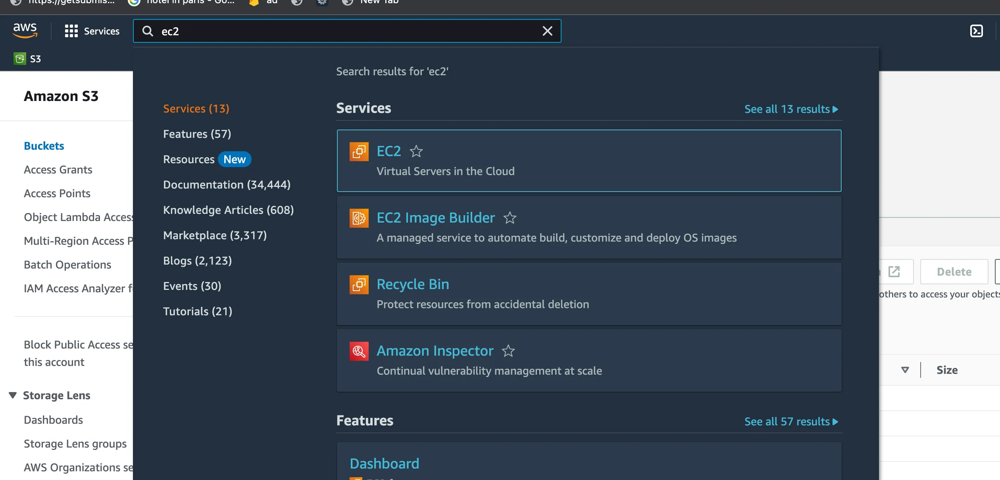

### Machine Properties
1. `Name` - webcraft is a site project.

2. `Instance ID` - ID of the virtual machine.

3. `Instance Type` 
   - t2.small refers to a machine with small size i.e. 2 CPUs 4GB RAM.
   - t2.medium refers to a machine with medium size i.e. 4 CPUs 8GB RAM.
   - etc.

4. `Alarm Status`
   - The size of the Virtual Machine is exhausted or something else.

5. `Availabilty Zone` 
   - ap-south-1a refers to a isolated datacenter.

6. `Domain name`
   - Some domain name is provided by the AWS.
   - It is not a sophisticated domain name but there is a domain name.

7. `Public IPv4` 
   - It is Public IP Address given by the AWS.
   - If it is elastic it will not change, otherwise it will change.
   - By default an instance has 5 elastic IPs.

- These are the properties of a machine from an AWS account.

## Step 3 - Creating a new EC2 server
1. Click on Launch a new instance
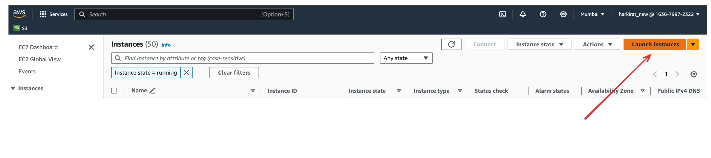

2. Give a name 
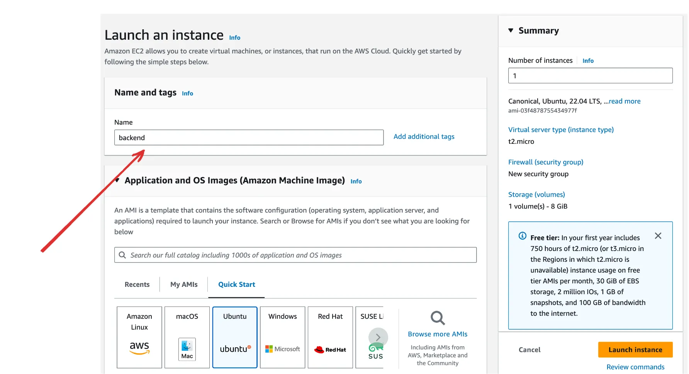

3. Select an OS 
   - Select the Ubuntu latest machine if there is no use case which involves using earlier version of the Ubuntu like c groups.
   - These CGroups app i.e. `judge0` which is used by leetcode, take you forward uses Ubuntu version 20.
   - Implement judge0 using healthcharts using a kubernetes cluster -> $200 Bounty.
   - Ubuntu 20 uses different version of CGroups and Ubuntu 24 uses different version of  CGroups.
   - CGroups are a way to limit resources in a cluster, like when we submit a problem on leetcode allow the user to use only a limited amount of memory and CPU.
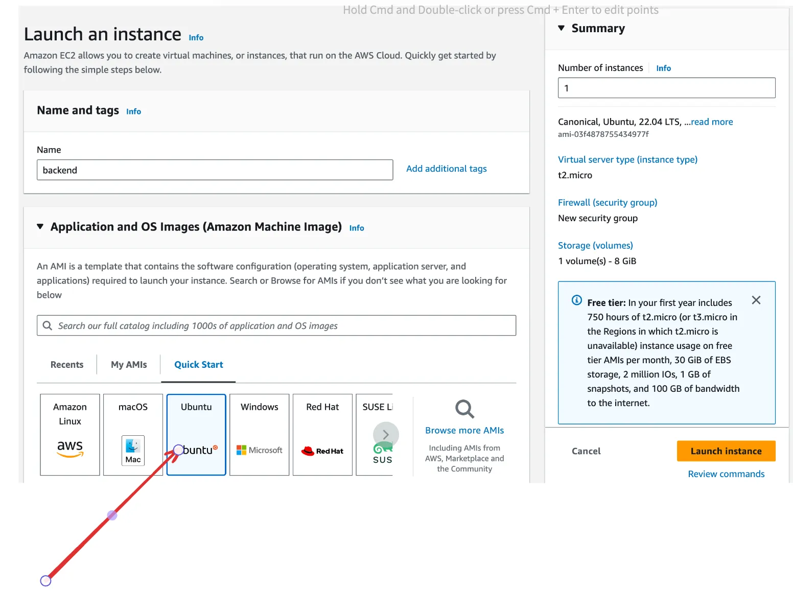

4. Select size
   - It depends on the number of users.
   - If we have small number of users use a micro machine.
   - It allows the user to get the access of a machine for free for few days.
   - If we have a NextJS or ReactJS Application do not use a micro machine as it will go out of memory.
   - Build it seperately and then push it onto the machine, do not build it on the machine.
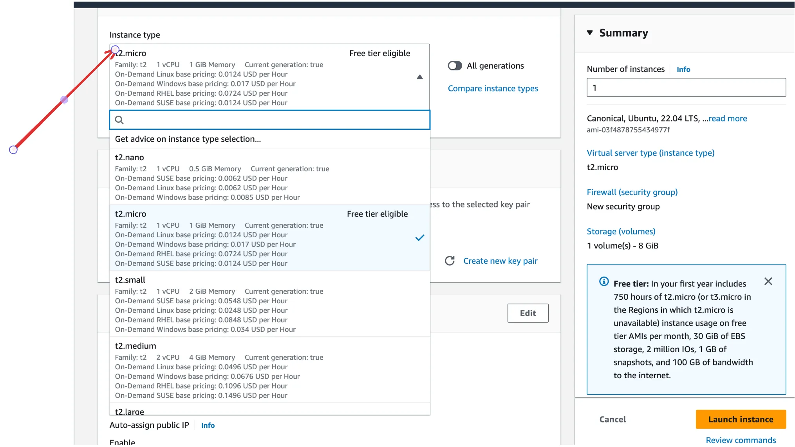

5. Create a new Key pair
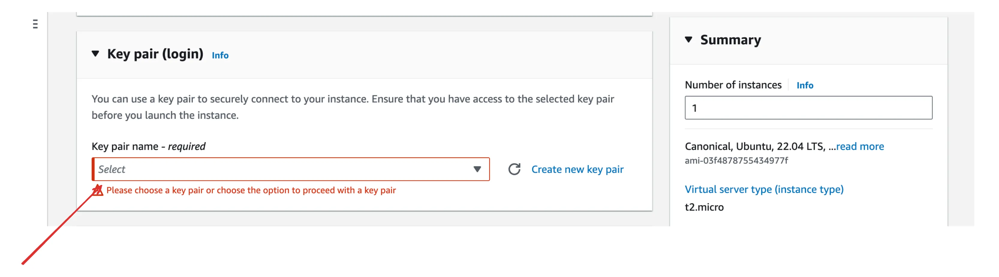
   - This step will create a public and private key pair for a new user.
   - There are two types of Algorithms used i.e. RSA and ED25519 which defines how the keys will be signed.
   - The `private key` will be downloaded as the `.pem` file.
   - The person with the `.pem` private key can `access(SSH)` the machine.
   - The keys are based on the type of the role of the person like tester, developer etc.

6. Select Size
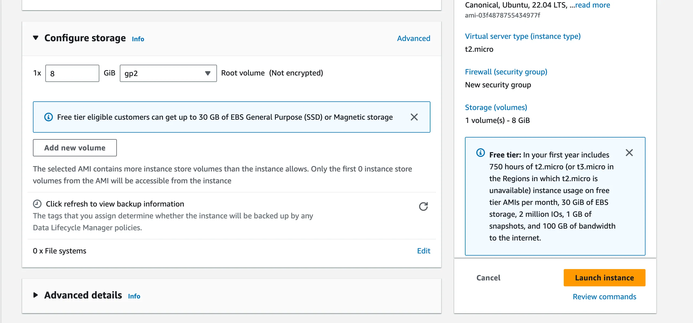

7. Allow traffic on http/https
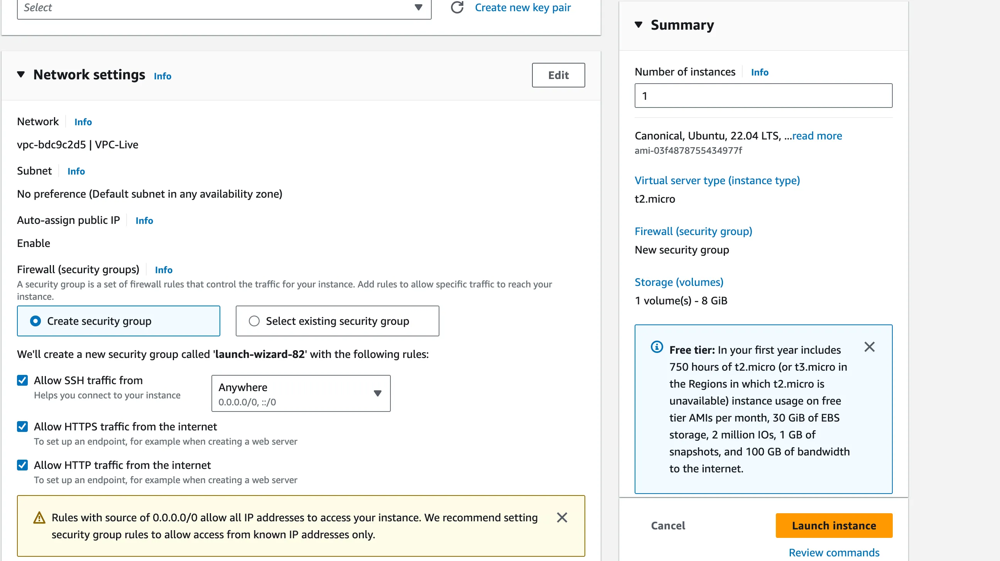

- We can only deploy judge0 on ubuntu version 20 not on 24.
- Platforms like leetcode etc. use the judge0.

## Steps:
0. `Naming the VM`
1. `Selected the OS and Version` => Ubuntu 24
2. `Selected Instance Type`
3. `Selected the keypair` -> Private Key(.pem) -> Downloaded Locally.
4. `Security group` => Enable and Disable the Port No.
- It is a construct in AWS like EC2, S3, Cloudflare are construct.
5. `Added Storage` => Added 16gb storage.

## NOTE:
- On AWS, after we start the machine we cannot access the VMs on any given Port No.
- Security Groups enable or disable the access to the port no. on virtual machine.
- SSH access is given by the Security Group on port 22 to access the machine otherwise the machine will not be accessable.
- If the NodeJS application is on the port no 3000, then enable the port no. 3000 using the Security Group to access the NodeJS application.
- `Source type` should be Anywhere since we want to access the machine from anywhere, if can be made strict to a certain IP addesss as well.

- NodeJS application => Uses HTTP Protocol(application layer) => Uses TCP Protocol(transport layer).
- When we run an application(Application Layer) we enable Express Server/HTTP Server.
- We will select the TCP Protocol because we want to open the HTTP protocol.
- Select the TCP Protocol in the Security Group with a port no 3000 for NodeJS application.
- ReactJS application => For multiple application use a range of port no's.
- `Source type` should be Anywhere.

- Port 22 should be for the personal IP address but NodeJS, ReactJS or NextJS should be for any IP which wants to access the application.
- If we want the application to be accessed by only some countries then limit the access by giving the IP ranges, this is the reason for the issue we faced in the Swiggy Backend APIs.
- Some machines do not require exposure to the outside world that much so the ports are not exposed to that extent.

- The Instance type are also dependent on the application use case.


**Now we are ready to launch the server - Launch the Server**

## Step 4: Connect to the machine
1. Give ssh key permissions to be accessed
```cmd
   chmod 700 kirat-class.pem
```

2. ssh into machine
```cmd
   ssh -i kirat-class.pem ubuntu@ec2-65-0-180-32.ap-south-1.compute.amazonaws.com
```
  - -i means that use this as an input .pem file.
  - File name which has the private key -> .pem file.
  - Machine name having IP address and location of the data center.

3. Clone repo in the Virtual Machine
```cmd
   git clone https://github.com/hkirat/sum-server
```
- If your aws machine shows you the following error, your aws machine doesn’t have access to the internet. 
- Solution - [Solution Link](https://www.tecmint.com/resolve-temporary-failure-in-name-resolution/)
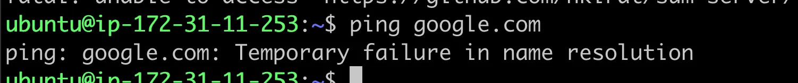

4. Install Node.js
   - [Link to Install](https://www.digitalocean.com/community/tutorials/how-to-install-node-js-on-ubuntu-20-04)
   - Curl command can also be used to install the package.
```cmd
   sudo apt-getinstall node
```

5. Install all dependencies of the Project
```cmd
   cd sum-server
   npm install
```

6. Start backend application
```cmd
   node index.js
```
- The port no. in the index.js file should be the same as the one mentioned in the AWS.
- Change the port no in the application or change the inbound of the AWS instance.
- After this the app is live over the internet.

## Step 6 - Try hitting the server
- You have an ip/DNS that you can hit to access your ec2 server
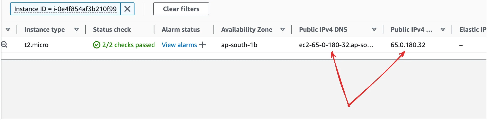

- Try visiting the backend
```cmd
   your_domain:3000
```
- `Notice` you can’t visit the website during this time
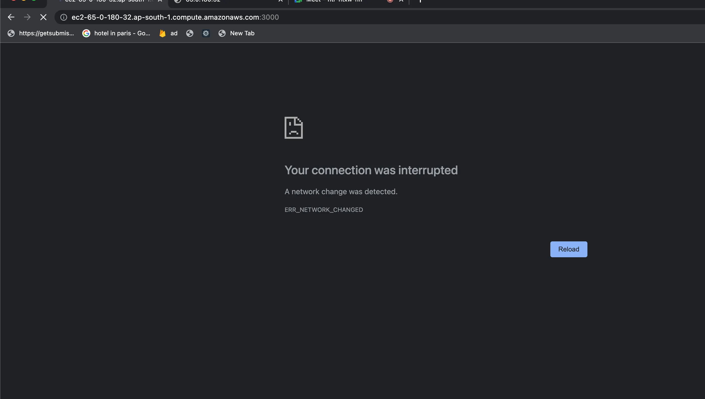

- **Security group**
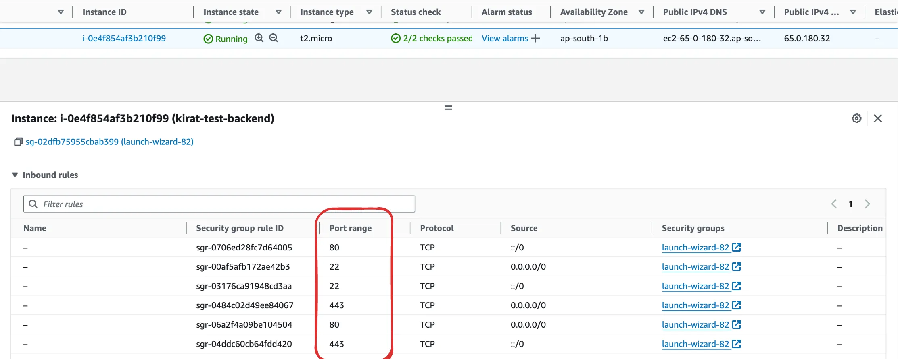
- You can either open port 8080, or process on port 80
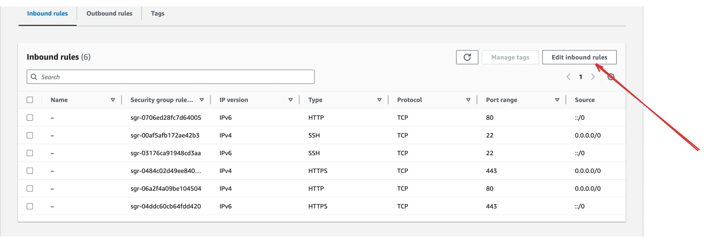
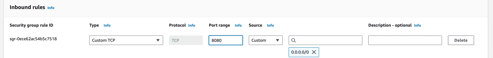

```cmd
   http://your_domain:8080
```

### More commands
```cmd
   ls -al
```
  - This command is used to see the read write and execute permissions of the file.
  - chmod is used to change the permissions of the file.
  - 7 means I have all the access.
  - 0 means 2nd and 3rd user does not have any rights.
  - This is why 700 is used.

- EC2 is not used for the React Deployment.

## Step 6: Reverse Proxy ft. nginx
- Forward proxy are done in the campus i.e. the proxy setting used in the systems.
- Nginx, Apache, Ha Proxy, Traffic proxy comes in the GSoC.
- It will also be required in nginx ingress controller.
- google.com uses the port 443 by default when we type the 
```cmd
   https://www.google.com
            or
   https://www.google.com:443
```
- These two are same.
- Similarly, if the application is running on the port 80 then we do not have to mention the port explicitly.
```cmd
   https://www.anything.com
         or
   https://www.anything.com:80
```
- The AWS will never allow the application to run on the port no 80.
- For this we need nginx.


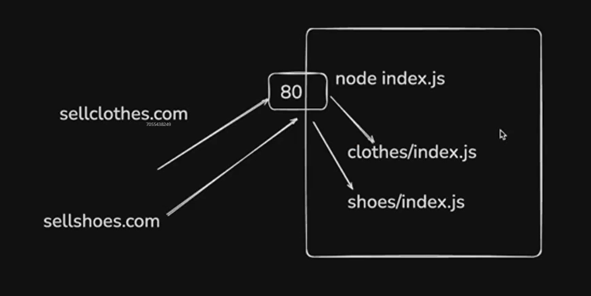
- We need to find a way such that two addresses point to the same port but still redirect to the different servers.

### Nginx
- [Nginx Link](https://www.nginx.com/resources/glossary/nginx/)
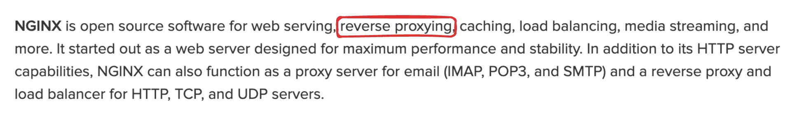

- If the certain website blocks a certain network's user network, blocked users try to acess the network using some other location, it is called forward proxy. Same thing is used in VPN.
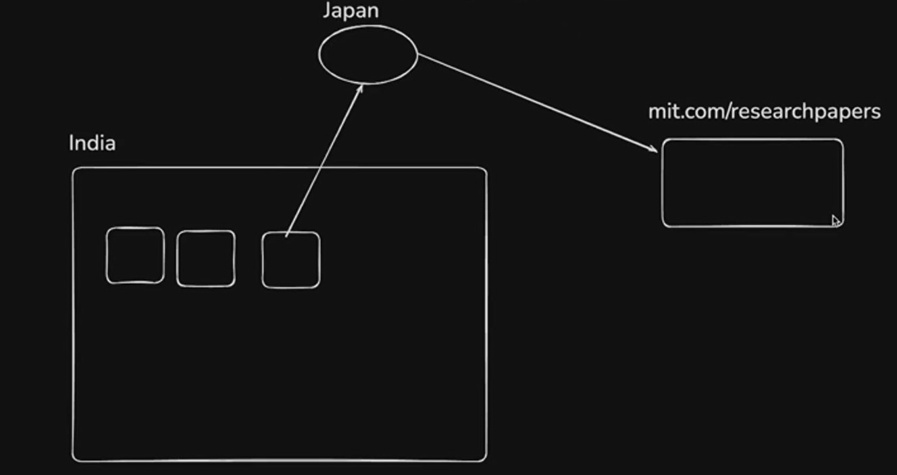

- In the reverse proxy we do not forward the request to a certain port immediately, nginx does that on our behalf.
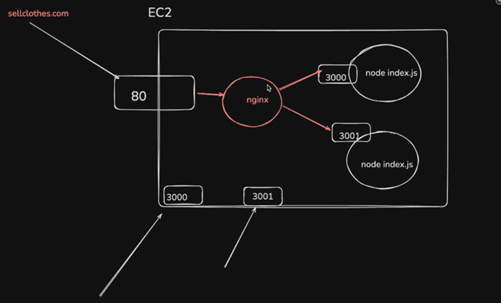

### What is a reverse proxy?
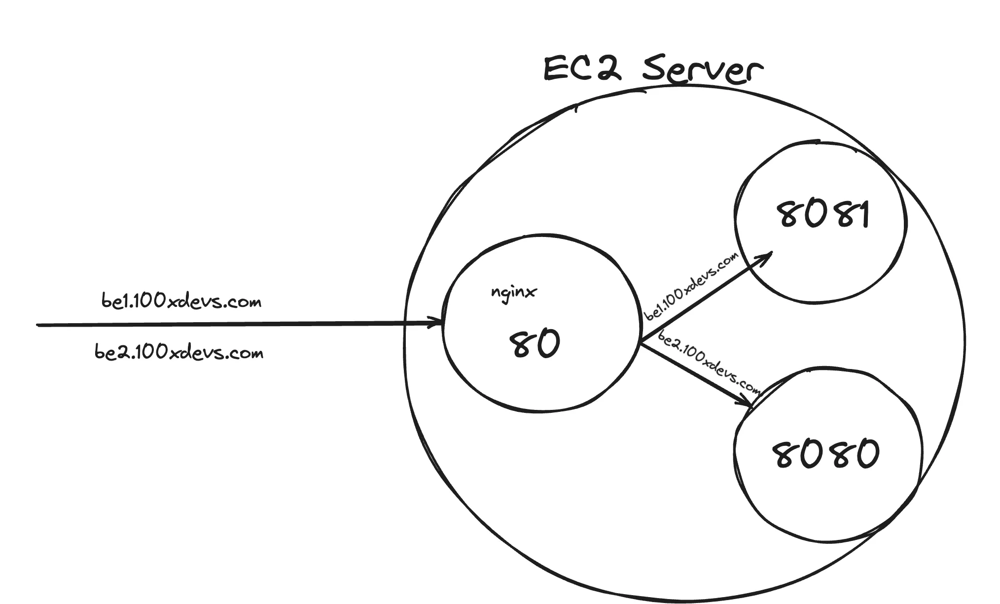
- Load balancers also use the nginx or proxy.
- This will solve the problem to give the port no. manually.

#### 1. Installing nginx
```cmd
sudo apt update
sudo apt install nginx
```

- This should start a nginx server on port 80.
- Try visiting the website.

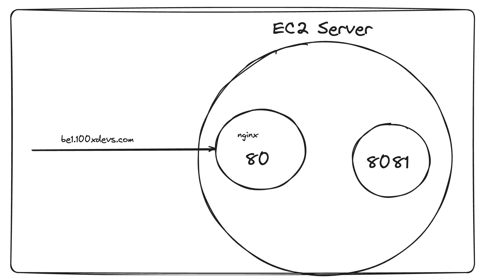

#### 2. Create reverse proxy
```cmd
sudo rm sudo vi /etc/nginx/nginx.conf
sudo vi /etc/nginx/nginx.conf
```

```js
events {
    # Event directives...
}

http {
	server {
    listen 80;
    server_name be1.100xdevs.com;

    location / {
        proxy_pass http://localhost:8080;
        proxy_http_version 1.1;
        proxy_set_header Upgrade $http_upgrade;
        proxy_set_header Connection 'upgrade';
        proxy_set_header Host $host;
        proxy_cache_bypass $http_upgrade;
    }
	}

  	server {
    listen 80;
    server_name yoyo1.100xdevs.com;

    location / {
        proxy_pass http://localhost:8081;
        proxy_http_version 1.1;
        proxy_set_header Upgrade $http_upgrade;
        proxy_set_header Connection 'upgrade';
        proxy_set_header Host $host;
        proxy_cache_bypass $http_upgrade;
    }
	}

}
```
- Any http request coming to server with port 80 with servername `be1.100xdevs.com;`  points to the localhost:8080.
- We need to change the proxy_pass and server_name when we add more projects to the virtual machine.

#### 3. Restart the Nginx server
```cmd
   sudo nginx -s reload
```

#### 4. Start the Backend server
```cmd
   node index.js
```

#### 5. Visit the website
```cmd
   https://be1.100xdevs.com/
```

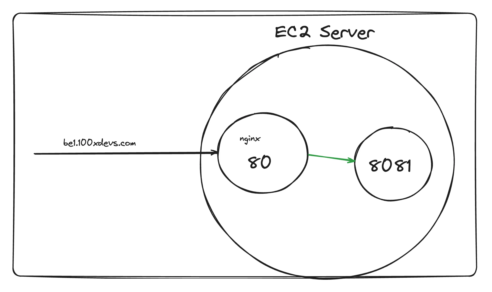

- sudo means super user do.
- nginx is difficult to write.

## Assignments:
1. Get a GCP account and do all the above steps.
2. Replace nginx with traefic/HAProxy/Apache.
3. Try deploying a react app.
4. Get a domain (namecheap)
5. Try ASGs
6. Try to do the certificate management.
7. Create a CI/CD pipeline to auto deploy to your server from Github.
8. Forever or Process Management 2.

## Step 7: Certificate management
- Use [Certificate Management Link](https://certbot.eff.org/).

## When we update app will be down what should we do?
- Load Balancer can be created in the AWS.
- Rolling Update can be done i.e. go to the new machine while the other machine is updating.

- This will be solved more sophisticatedly using the Kubernetes. This approach is very bad.

