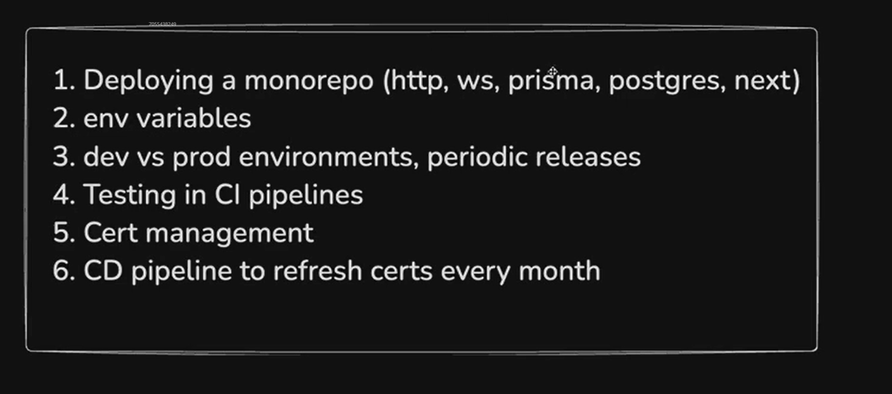
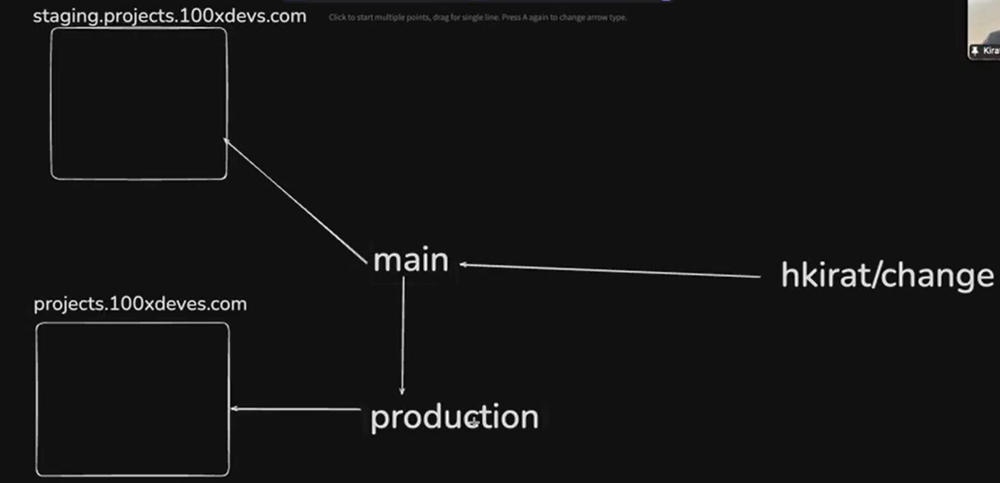
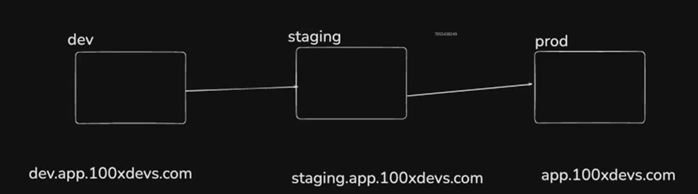
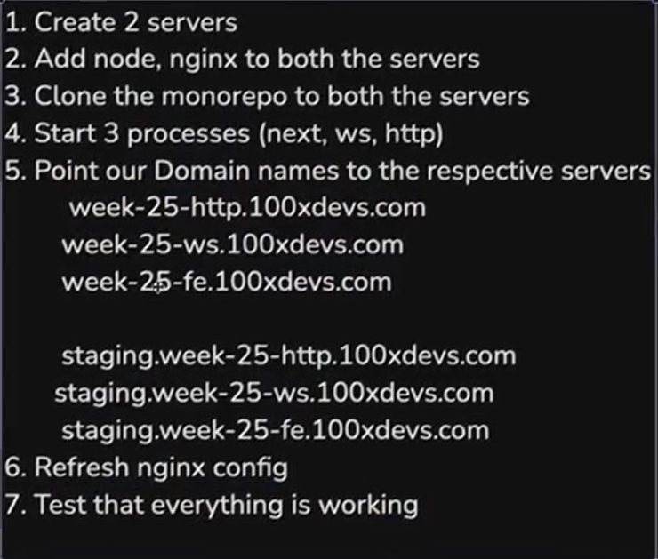
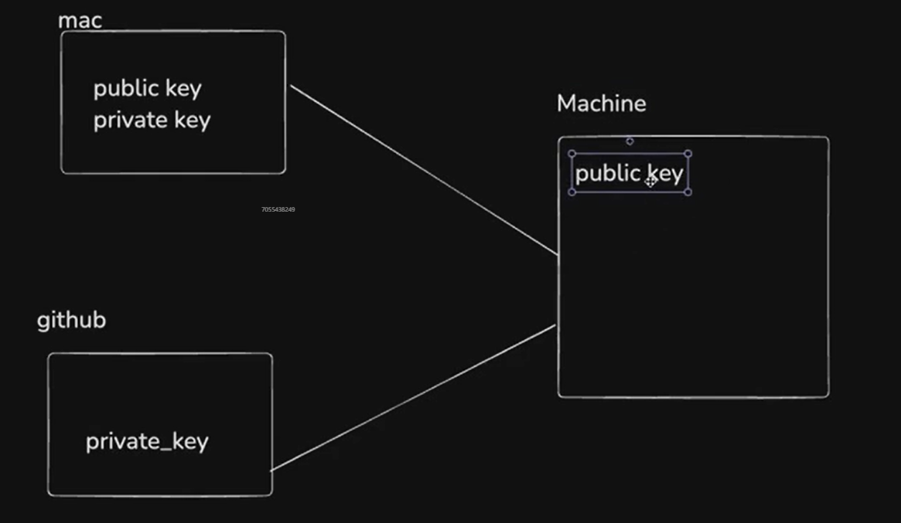
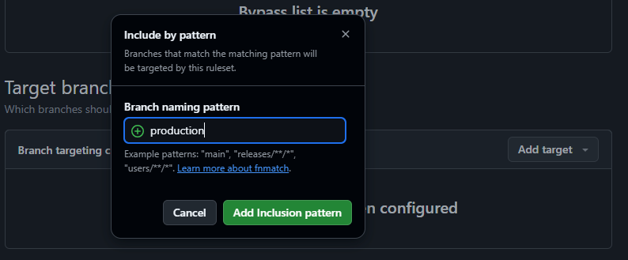

# Continuing CI, Certificate Management, Copy the data to the production and Testing 

## 1. Deploying a monorepo (HTTP Server, Web Socket, Prisma, Postgres, NextJS Server)
- Initialize a monorepo and deploy it to the cluster, not deploying to the EC2 deploy it somewhere else.

- We will be using the `pnpm` instead of the `npm` to make our life more difficult.
- There are more package managers like npm, pnpm, bun, yarn etc.
- Install the `pnpm` locally using the command:
```cmd
    npm install -g pnpm
```

- Start building the application.
```cmd
    npx create-turbo@latest
```
- Turborepo is a framework which allows to build a monorepo on the top of it.


## 2. Adding Backend Services
- We will be adding two services(directory) i.e. http-server and ws-server in the apps folder, i.e. http server and the web socket server.

## 3. Adding the ORM(Object Relation Mapping) ft. prisma.
- Prisma is the ORM which deals with the Database operations in the PostgreSQL.
- We will now be adding the prisma(directory) in the packages directory.
- We will build this first and the we will add the http-server and the web-server to this.
```cmd
    cd packages/
    mkdir prisma
    cd packages/prisma/

```

- We will be creating a `package.json` file in the `prisma/` using the command.

```cmd
    npm init -y
```

- Now we will be adding a `tsconfig.json` to the `prisma/` directory using the command.

```cmd
    npx tsc --init
```

- In the `tsconfig.json` we extended the base.json to get all the properties of that file.
```js
{
  "extends": "@repo/typescript-config/base.json"
}
```

- Add the `devDependencies` in the prisma's `package.json` file.
```js
{
  "name": "@repo/db",
  "version": "1.0.0",
  "main": "index.js",
  "keywords": [],
  "author": "",
  "devDependencies": {
    "@repo/typescript-config": "workspace:*"
  },
  "license": "ISC",
  "description": "",
  "dependencies": {
    "prisma": "^6.17.1"
  }
}
```

- In the root package manager i.e. `package.json` we have the `pnpm` package manager.
- Add the prisma dependency to the prisma package.
```cmd
    pnpm add prisma
```

- ORM makes the database connection simpler.
- The schema.prisma file will be created in the `prisma/` directory using the command.
```cmd
    npx prisma init
```

- Now create the Schema in the `schema.prisma`.
```prisma
model User{
  id  String  @id   @default(uuid())
  username  String  @unique
  password  String
}
```

- Now we will get the database from the [Neon Tech](https://neon.com/).
- Signup and Create a database named `class-testing`, choose any cloud provider.
- Copy the database URL using the connection string option and paste it in the `.env` file.
- To connect the prisma to the Neon Tech DB.
```cmd
    npx prisma migrate dev
```

- Now create the table in the database using the `create_users_table` command.
- It will also create a `migration.sql` in the `prisma/migrations/...create_users.table/migration.sql`.

- Now we will have to export the `prisma client` so that the servers like `http-server` and the `web-server` will be able to import them.
- Create the directory in the `prisma/src/index.ts`.
- Now create an `exports` field in the package.json file to export the client.

## 4. NextJS Application:
- Now we can import the client from the page.tsx file from the `web/` directory which is the NextJS Application.
- In the `apps/web/app/page.tsx` import the client like:
```js
  import { client } from "@repo/db/client";
```

- In the dub.sh they have`packages/prisma/package.json` they export `client` from the `client.ts`.
- In the NextJS Server's package.json add the `@repo/db` devdependency.
- This will allow us to use the dependency to interact with the database in the NextJS Application.
- Now the import will still not work because we have only written the dependency in the package.json.
- We have not done the `pnpm install`. Doing the installation on the global level will let the packages install on sublevel as well.
- Now we can add use the client object in the page.tsx file.
```js
  client.user.findOne()
```
- Till now we have only made the application not deployment.

## 5. Create the Backend services:
- In the `http-server/` we will be creating the backend services.
```js
  npm init -y // Create the package.json
  npx tsc --init // Create the tsconfig.json
```

- In the `tsconfig.json` we will be writing a list of objects.
```js
{
  "extends":"@repo/typescript-config/base.json",
  "compilerOptions": {
    "rootDir": "./src",
    "outDir": "./dist"
  }
}
```

- The source code will be present in the `/src` folder.
- The output of the code will be present in the `/dist` folder.
- Add the devDependencies in the `package.json` file in the http-server. 
```js
  "devDependencies": {
    "@repo/db": "workspace:*",
    "@repo/typescript-config": "workspace:*"
  },
```
- Add the build scripts in the `package.json` file.
```js
  "scripts": {
    "build": "tsc -b",
    "dev": "npm run build && npm run start",
    "start": "node dist/index.js"
  },
```
- Do the same thing in the ws-server.
- Now write the source code.
- Add `express` as a dependency in the http-server.
```cmd
  npm install express @types/express
```

## 6. Execute the application
- To execute the application with the following ports:
- **NextJS Application** 
  - It will be executed using the following command
  - `npm run dev`
  - The port number can be changed from the `package.json` file.
- **http-server**
  - It will also be executed using the same command as listed above.
  - It will run on the port number mentioned in the index.ts file.
- **ws-server**
  - It will also be executed using the same command as listed above.
  - It will run on the port number mentioned in the index.ts file.

## Dev Staging and Producion Environment
- In the CI/CD pipeline, if we are auto deploying from the github to the server.
- Pushing the code to the main branch will lead to deploying code on the server.
- We do not push the code to the main branch -> production branch -> `website.com`.
- We push the code to the dev branch, which will push the code to the `staging.website.com`.

- [CI/CD for 100xdevs.com](https://github.com/code100x/daily-code/blob/main/.github/workflows/cd.yml) 
- For the merge on the production branch.
```yml
name: Continuous Deployment
on:
  push:
    branches: [ main ]
```

- For the merge on the main branch.
```yml
name: Continuous Deployment (Prod)
on:
  push:
    branches: [ production ]
```

- We will create a new branch.
```git
  git checkout -b production
  git push origin HEAD
```

- main branch should push to the main server.
- production branch should push to the production server.
- Testing is done on the staging environment.


## Deploying the Monorepo


- The developer should not be able to ssh into the machine.
- Vercel charges heavily for the CI/CD Pipeline.
- We should know how to build the pipeline.
 
### 1. Connect to the Cloud Server
- Create the public key and the private key, we can use our own public and private key which are the default ones.

- The command to create the public and private key.
```cmd
  ssh-keygen
```


- To display the public key
```cmd
~/.ssh/id_rsa.pub
```

- Now create the two instances on the Cloud -> AWS EC2 or Digital Ocean etc.
- Connect to the machine using the insert argument [`-i`], private key [`~/.ssh/id_rsa`] and the machine address [`root@IP_ADDRESS`].
```cmd
ssh -i ~/.ssh/id_rsa root@IP_ADDRESS
```

### 2. Install the NodeJS into the Machines `prod` and the `dev`
- [Using the following link](https://www.digitalocean.com/community/tutorials/how-to-install-node-js-on-ubuntu-22-04).
```cmd
curl -o- https://raw.githubusercontent.com/nvm-sh/nvm/v0.40.3/install.sh | bash
source ~/.bashrc
nvm install v22.16.0
```

### 3. Install the nginx on the machines `prod` and `dev`
```cmd
sudo apt update
sudo apt install nginx
```

### 4. Install the pnpm package manager on both the machines
```cmd
npm install -g pnpm
```

### 5. Pointing the domain to their correct location
- We will be using the `domain.squarespace.com` to buy the domain and point to the domain which we are using.
- Go to the DNS -> DNS Settings -> Add Records.
- Type is A, write the name.
- Give the IPaddress of the prod as well as the dev.

### 6. Clone the monorepo in both the servers
```cmd
  git clone https://github.com/rohit161996/bms.git
```

### 7. Run the following commands
- We will run the following command in the global environment in the prod as well as the dev.
```cmd
  pnpm install
```

### 8. Create the seperate database for both the production as well as the dev
- We will also create the pipeline to copy the prod DB to dev every day.
- Now add the URL of the database to the .env file of the dev and prod instances.
```cmd
  vi .env
```
- Contents of the file
```text
  DATABASE_URL = "URL"
```
- Now migrate the databases.
```cmd
  npx prisma migrate
```

- This is not the proper way to enter into our machine.


### 9. Run the Applications:
- Build the application on both the machines globally.
```cmd
   pnpm run build
```
- In this step the code is converted to the Javascript for the http-server and the ws-server.
- Now to run the code we will be using the process management.
- We can use the process management or the forever library for continously running the applications.
- Even if the system halts or stops then also the application will restart automatically.
- Install the package and run the process.
```cmd
  npm install -g pm2
  pm2 start npm --name "http-server" --start
  pm2 start npm --name "ws-server" --start
  pm2 start npm --name "fe-server" --start
```

- It is a process which shows the status -> `online/offline`, cpu -> `percentage`, memory -> `Memory size`.
- Do the above process for both the `dev` and `prod` machine.
- To see the processes:
```cmd
  pm2 list
```

- Now we need to run them on the port 80.
- We can check the DNS Propogation using the DNS Propogation checker.
- For this we have to use the reverse proxy ft. nginx.
- This is done using configuring the nginx configuration file.
```cmd
  sudo vi /etc/nginx/nginx.conf
```
- Add the nginx configuration.
```nginx
  events {
      # Event directives...
  }

  http {
    server {
      listen 80;
      server_name be1.100xdevs.com;

      location / {
          proxy_pass http://localhost:8080;
          proxy_http_version 1.1;
          proxy_set_header Upgrade $http_upgrade;
          proxy_set_header Connection 'upgrade';
          proxy_set_header Host $host;
          proxy_cache_bypass $http_upgrade;
      }
    }
  }
```
- This was for one process, change to the following configuration, in the production environment.
- Change the URL to `staging.week25-25-ws.100xdevs.com` in the dev machine/instance.
```nginx
    events {
        # Event directives...
    }

    http {
      server {
        listen 80;
        server_name week25-25-ws.100xdevs.com;

        location / {
            proxy_pass http://localhost:3001;
            proxy_http_version 1.1;
            proxy_set_header Upgrade $http_upgrade;
            proxy_set_header Connection 'upgrade';
            proxy_set_header Host $host;
            proxy_cache_bypass $http_upgrade;
        }
      }

      server {
        listen 80;
        server_name week25-25-http.100xdevs.com;

        location / {
            proxy_pass http://localhost:3002;
            proxy_http_version 1.1;
            proxy_set_header Upgrade $http_upgrade;
            proxy_set_header Connection 'upgrade';
            proxy_set_header Host $host;
            proxy_cache_bypass $http_upgrade;
        }
      }

      server {
        listen 80;
        server_name week25-25-fe.100xdevs.com;

        location / {
            proxy_pass http://localhost:3000;
            proxy_http_version 1.1;
            proxy_set_header Upgrade $http_upgrade;
            proxy_set_header Connection 'upgrade';
            proxy_set_header Host $host;
            proxy_cache_bypass $http_upgrade;
        }
      }
    }
```

- Now restart the nginx server.
- Check the following URLs:
  - week25-25-fe.100xdevs.com
  - week25-25-http.100xdevs.com
  - week25-25-ws.100xdevs.com

## 10. Changing the settings of the production branch on the github.
- Go to the github, then switch to the production branch of the project.
- Go to Settings -> Rulesets.
 
- Check the box -> Require signed commits
- Require pull before commits.

## Creating a CI/CD Pipeline in the github.
- We will be focusing on the Continous Deployment(CD) of the code from the main to production branch.
- Create a folder named `.github/workflow` in the root folder of the project.
- In this create 2 files namely `cd.prod.yml` and `cd_staging.yml`.
- Understanding the .yaml file of the [dubinc github](https://github.com/dubinc/dub)
- Go to .github -> workflows -> .yaml files.
```yaml
name: Public API Tests

on:
  deployment_status:

jobs:
  api-tests:
    timeout-minutes: 30
    if: github.event_name == 'deployment_status' && github.event.deployment_status.state == 'success'
    runs-on: ubuntu-latest
    steps:
      - name: Check out code
        uses: actions/checkout@v2

      - name: Setup pnpm
        uses: pnpm/action-setup@v3
        with:
          version: 8

      - name: Setup Node.js environment
        uses: actions/setup-node@v4
        with:
          node-version: 20
          cache: "pnpm"

      - name: Install dependencies
        run: pnpm install

      - name: Build utils
        working-directory: packages/utils
        run: pnpm build

      - name: Run tests
        working-directory: apps/web
        env:
          E2E_BASE_URL: ${{ github.event.deployment_status.environment_url }}
          E2E_TOKEN: ${{ secrets.E2E_TOKEN }}
          E2E_TOKEN_OLD: ${{ secrets.E2E_TOKEN_OLD }}
          E2E_PUBLISHABLE_KEY: ${{ secrets.E2E_PUBLISHABLE_KEY }}
          QSTASH_TOKEN: ${{ secrets.QSTASH_TOKEN }}
          QSTASH_CURRENT_SIGNING_KEY: ${{ secrets.QSTASH_CURRENT_SIGNING_KEY }}
          NEXT_PUBLIC_NGROK_URL: ${{ github.event.deployment_status.environment_url }}
        run: pnpm test
```
- This job is for 30 minutes after that it fails.
- It has only one job named `api-tests`.
```yaml
name: Prettier Check

on:
  push:
    branches:
      - main
  pull_request:
    branches:
      - main
  workflow_dispatch:

jobs:
  build:
    runs-on: ubuntu-latest
    steps:
      - name: Check out code
        uses: actions/checkout@v4

      - name: Setup pnpm
        uses: pnpm/action-setup@v3
        with:
          version: 8

      - name: Install dependencies
        run: pnpm install

      - name: Fix prettier issues
        run: pnpm run format

      - name: Check prettier format
        run: pnpm run prettier-check
```
- This job is named `Prettier Check`,
- It is triggered on the push to the main branch and pull from the main branch.
- There is only one job in this named build.
- Whenever there is a pull request which is made, run : part of the .yaml file runs.
- We can add the CI pipeline or a CD pipeline on the github to test the code or deploy the code.

### Continously Deploy the code fron the github to the server.
- Steps to automatically deploy the code from the github to Virtual Machine.
  - Step 1. `ssh` to the machine.
  - Step 2. `cd Project` to change the directory to the project folder.
  - Step 3. `git pull` to take the latest changes.
  - Step 4. `pnpm build` to build the project.
  - Step 5. `pm2 restart http-server` to restart the processes.
  - Step 6. `pm2 restart ws-server` to restart the processes.
  - Step 7. `pm2 restart fe-server` to restart the processes.

- Now we will be creating the CI/CD Pipeline to deploy this to the AWS automatically.
- In the cd_staging.yml file we will be writing the commands to do the following things:
  - `Step 1.` SSH to the machine, but we cannot just directly expose the private key to the Github so we will be adding the private key to the github `Secrets and variables` section of the section.
    - Name * - SSH_PRIVATE_KEY.
    - Secret * - Key.
  - `Step 2.` Dump the SSH_PRIVATE_KEY to the file in the github and add connect to the machine.
  - Rest of the steps are very straight forward.
```yaml
name: Deploy to staging

on:
  push:
    branches:
      - "main"

jobs:
  redeploy_frontend:
    runs-on: ubuntu-latest
    name: Deploying everything to the staging cluster
    steps:
      - run: |
          echo "${{ secrets.SSH_PRIVATE_KEY }}" &> ~/ssh_key
          mkdir .ssh
          echo "${{ secrets.KNOWN_HOSTS }}" &> ~/.ssh/known_hosts
          ssh -i ~/ssh_key root@64.227.147.124
          cd Project_Dir/ && git pull
          pnpm install
          pnpm run build
          pm2 restart http-server
          pm2 restart ws-server
          pm2 restart fe-server
```

- Now when we will push the code to the github there will be an error due to logging in for the first time.
- The error of the type are you sure etc. which has the solution `ssh-keygen -R 192.168.7.1`.
- The ubuntu machine does not have a knownhosts file in it.
- We will be giving the knownhosts file to the ubuntu machine.
```yaml
  echo "yes" | ssh -i ~/ssh_key root@64.227.147.124
```
- We can use both the bash script commands as well as the github actions(which someone else has written and we are using it).
- We deploy on the Autoscaling Group or a Kubernetes Cluster, in that way we do not have to ssh to the machine.
- Now when we deploy the application to the github it automatically will deploy to the AWS or Cloud.

## WARNING:
- Do not use the following command openly, it will expose the private key.
```cmd
~/.ssh/id_rsa
```


