# Docker
## Step 1: Why Docker?
- Docker is the biggest runtime for creating the containers.

- Docker files are created for every microservice which are created in a monorepo.

- We should containerize all the microservices.

- Docker lets us create containers, which eventually lets us facilitate the container orchestration.

- We do not have to install the dependencies or give the access of our file system to a malicious code in the global environment, we can do this in the virtual environment with the help of the Docker.


- Docker/containers are important for a few reasons -
  1. Kubernetes/Container orchestration
  2. Running processes in isolated environments

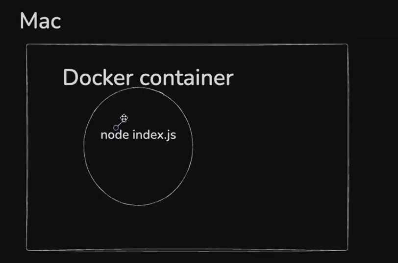

```cmd
    node index.js
    docker run index.js
```
  3. Starting projects/auxilary services locally
     - We can start the redis, mongodb, or postgresql or any other database globally or in a docker container.
     - For every open source project to start, there are two ways to start the project, `manual installation` or `docker installation`.
     - Every good open source project has the other way of execution called the docker installation.
     - The `Docker` way would be of much less hassle.
     - We can use `actionable docker` as a tool for our daily basis task.

## Step 2: Containerization
### What are containers?
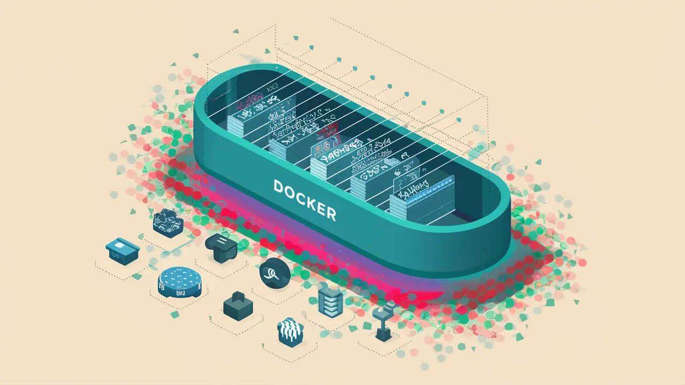

- **Containers** are a `ways` to `package and distribute software applications` in a way that makes them `easy to deploy` and `run` consistently across `different environments`.

- They allow you to `package an application`, along with all its `dependencies` and `libraries`, into a `single unit` that can be run on any machine with a container runtime, such as Docker.

- We get a networking system and several other systems along with the file system in the docker container.

### Why containers?
1. Everyone has different Operating systems.

2. Steps to run a project can vary based on Operating System.

3. Extremely harder to keep track of dependencies as project grows

### Benefits of using containers

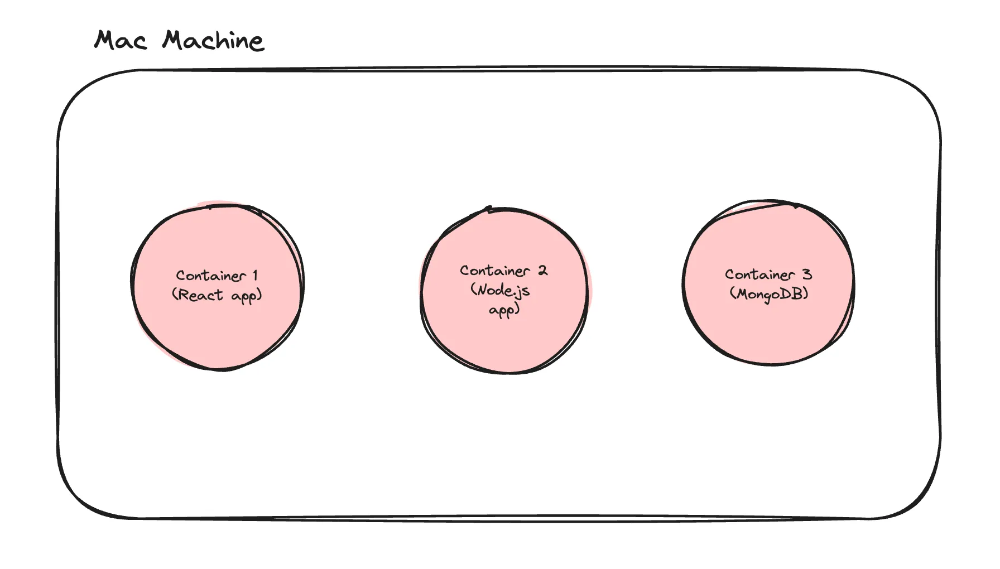

1. Let you describe your `configuration` in a single file, the Docker image which is run using the command `docker run imageCreated` is created using a configuration file.

2. Can run in isolated environments

3. Makes Local setup of Open Source projects a breeze(easy).

4. Makes installing auxiliary services/DBs easy. 

### References
- For Reference, the following command starts mongo in all operating systems - 
```cmd
    docker run -d -p 27017:27017 mongo
```
-  Docker isn’t the only way to create containers

## Step 3:


- Docker is a YC backed company, started in ~2014

- They envisioned a world where containers would become mainstream and people would deploy their applications using them. That is mostly true today.

- Most projects that you open on Github will/should have docker files in them (a way to create docker containers).

- [Reference Documents](https://www.ycombinator.com/blog/solomon-hykes-docker-dotcloud-interview/)

## Step 4:
- [Docket Installation Link](https://docs.docker.com/engine/install/)

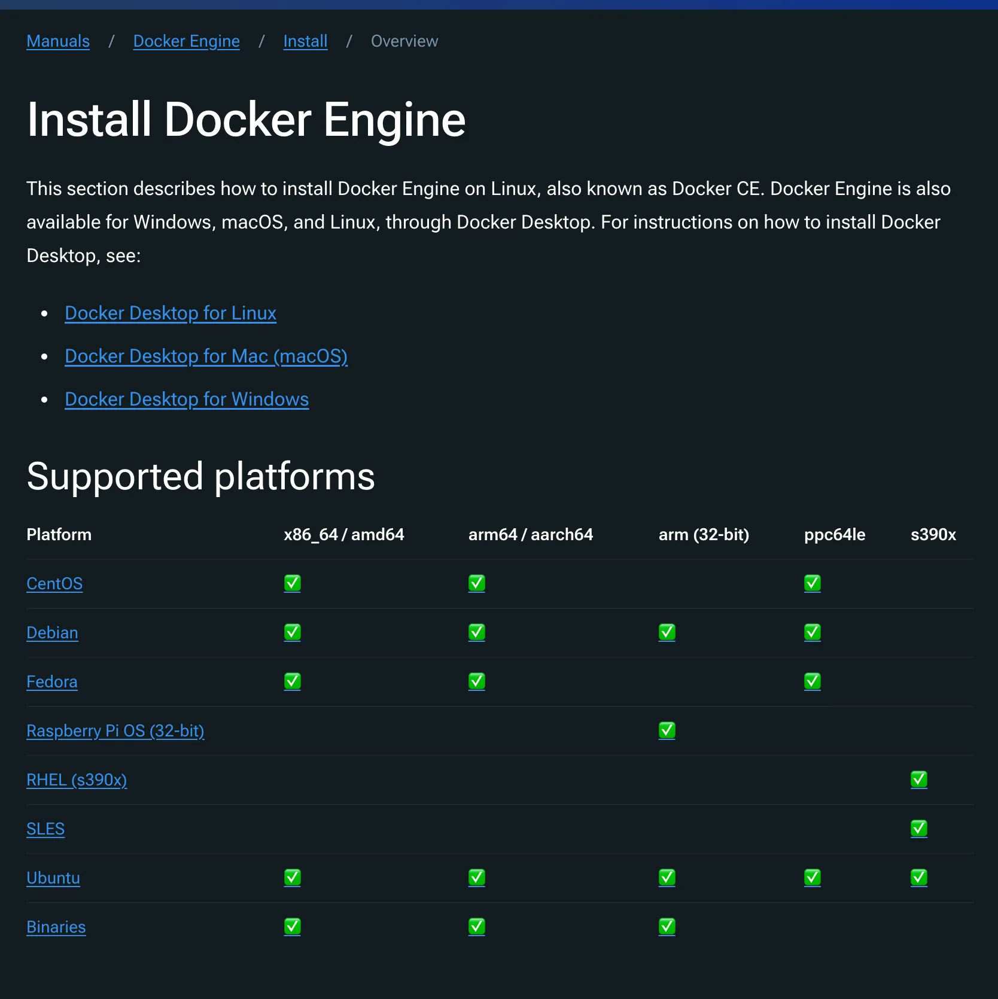

- Make sure you’re able to run the docker cli locally

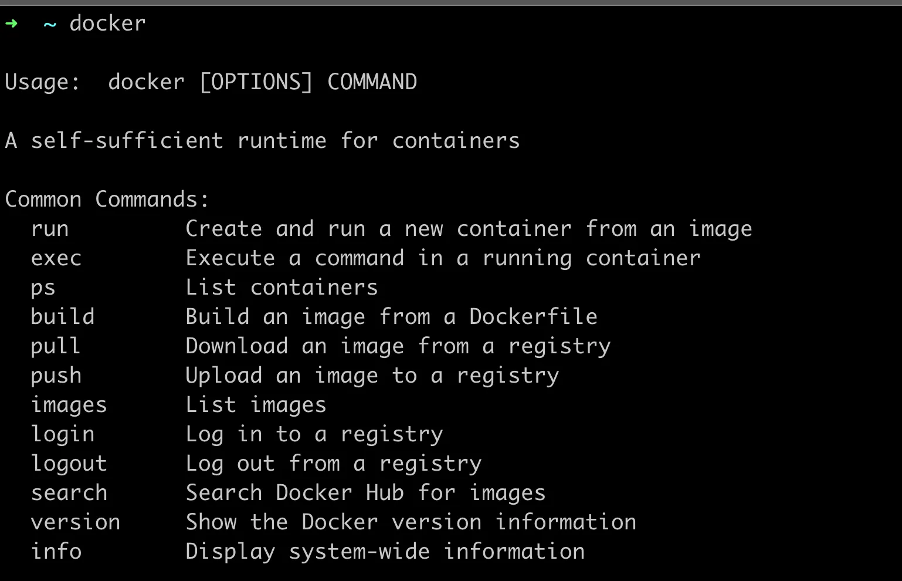

## Step 5 - Inside docker

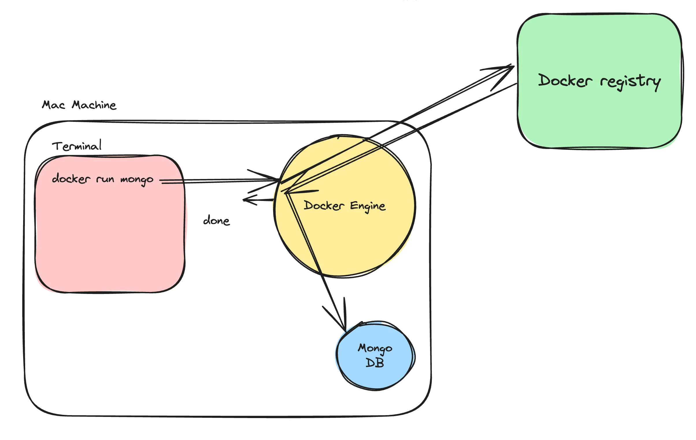

- As an application/full stack developer, you need to be comfortable with the following terminologies -
1. **Docker Engine**
2. **Docker CLI** - Command line interface
3. **Docker registry**

### 1. Docker Engine
- Docker Engine is an open-source `containerization` technology that allows developers to package applications into `container`.

- Containers are standardized executable components combining application source code with the operating system (OS) libraries and dependencies required to run that code in any environment.

### 2. Docker CLI
- The command line interface lets you talk to the `docker engine` and lets you start/stop/list containers.
```cmd
    docker run -d -p 27017:27017 mongo
```

- Docker cli is not the only way to talk to a docker engine. You can hit the docker `REST` API to do the same things

### 3. Docker registry
- The `docker` registry is how Docker makes money. 
- It is similar to github, but it lets you push images rather than sourcecode.
- [Docker’s main registry](https://dockerhub.com/)
- [Mongo image on docker registry](https://hub.docker.com/_/mongo)
- When we run `npm install express` the code for the express comes to the local machine as a registry, pip registry for python, github registry.

- When we run the command `docker run mongo` in the Terminal, system checks for the mongo in `Docker Engine` and if it is not found in the `Docker Engine`, it gets the image from the `Docker registry` and it executes it locally.

- With npm we get files, with docker we get a small machine(container) which runs locally.
- Docker registry is a container registry, like github is a code registry.
- Port Mapping of MongoDB to 27017 using the command:
```cmd
  docker run -p 27017:27017 mongo
```

- Remove the image from the system using the command
```cmd
  docker rmi --force mongo
```

- To list down the images of the docker file:
```cmd
  docker images
```

## Step 6 - Images vs containers
### Docker Image
- A Docker image is a lightweight, standalone, executable package that includes everything needed to run a piece of software, including the code, a runtime, libraries, environment variables, and config files.

- A good mental model for an image is `codebase on github`.

### Docker Container
- A container is a running instance of an image. It encapsulates the application or service and its dependencies, running in an isolated environment.

- A good mental model for a container is when you run `node index.js` on your machine from some source code you got from github.

### NOTE:
- We wil have the image in our machine, irrespective of the fact that we run the container or not.

- Command to check that which containers are running.
```cmd
  docker ps
```

- We can start multiple containers of docker, it can be done using multiple terminals opened at a same time.


## Step 7 - Port Mapping to Container
- If we run the container using the following command without port mapping, it will start the container with the port no. but it is not exposed to the port no. of the machine until we do the port mapping.
```cmd
  docker run mongo
```

- Do the port mapping as follows, such that the machine's port is mapped to the container port:
```cmd
  docker run -d -p 27018:27017 mongo
```
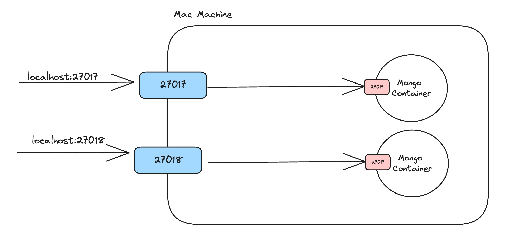

- Now the windows machine's port 27018 will map to 27017.
```cmd
  docker run -d -p 27018:27017 mongo
```

- Now both the mongodb will run seperately on port 27017 and 27018.

## Step 8 - Common Docker Commands
1. docker images
2. docker ps
3. docker run
4. docker build

### 1. **docker images**
Shows you all the images that you have on your machine

### 2. **docker ps**
Shows you all the containers you are running on your machine

### 3. **docker run**
Lets you start a container
- -p ⇒ let’s you create a port mapping
- -d. ⇒ Let’s you run it in detatched mode

### 4. **docker build**
Lets you build an image. We will see this after we understand how to create your own `Dockerfile`

### 5. **docker push**
Lets you push your image to a registry

### 6. **Extra commands**
1. docker kill - To kill the container instance of the image this command is used.
2. docker exec - To execute the command in the docker container this command is used.
```cmd
  docker exec -it CONATINER_ID /bin/bash
  docker exec -it CONATINER_ID sh
```

## Step 9 - Dockerfile
### What is a Dockerfile?
- If you want to create an image from your own code, that you can push to `dockerhub`, you need to create a `Dockerfile` for your application.

- A Dockerfile is a text document that contains all the commands a user could call on the command line to create an image.

- A use case to give the container to everyone to use it to scrape the data.

- Build a NodeJS application with the following commands:
```cmd
  mkdir nodejs-project
  cd nodejs-project/
  npm init
  npm i express
```

- Create a `Dockerfile` in the root folder of the nodejs project, to containerize the application.

### How to write a dockerfile?
- A docker file has 2 parts:
  1. Base Image - If we know that the project will be a NodeJS, then we can set the base image of the project.
  2. Bunch of commands that you run on the base image (to install dependencies like Node.js)

### Let's write our own docker file:
- Let’s try to containerise this backend app - [Github Link](https://github.com/100xdevs-cohort-2/week-15-live-1)

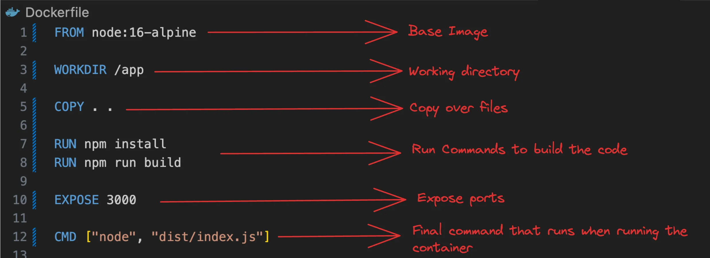


### Common commands :-
- `WORKDIR`: Sets the working directory for any RUN, CMD, ENTRYPOINT, COPY instructions that follow it.

- `RUN`: Executes any commands in a new layer on top of the current image and commits the results.

- `CMD`: Provides defaults for executing a container. There can only be one CMD instruction in a Dockerfile.

- `EXPOSE`: Informs Docker that the container listens on the specified network ports at runtime.

- `ENV`: Sets the environment variable.

- `COPY`: Allow files from the Docker host to be added to the Docker image

- We will be creating an /app directory in the container we are creating.

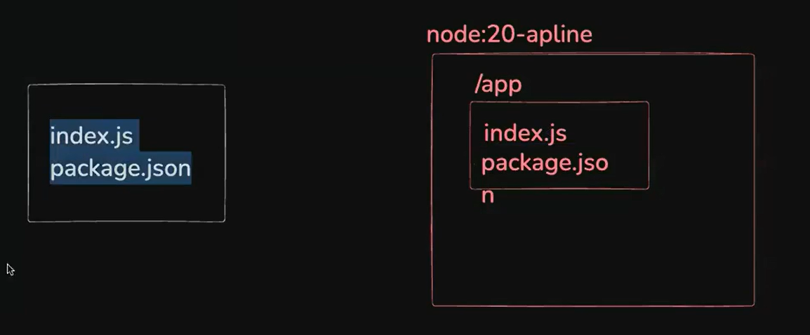

```docker
# Base Image 
FROM node:22-alpine

# Create the working directory in the container with the name /app
WORKDIR /app

# Copy all the files from the file system to the container
# COPY ./index.js ./index.js
# COPY ./package.json ./package.json
# Do not copy the node_modules in the container add the nodemodules in the .dockerignore
COPY . .

# Install the dependencies freshly
RUN npm install

# Expose the port 3000 from the process
EXPOSE 3000

# Creation of the Image uses the RUN command
# Executing the container uses the CMD 
# Execute NodeJS Software node index.js
CMD ["node", "index.js"]
```

## Step 10 - Building Images
- Now that you have a dockerfile in your project, try building a docker image from it give the tag name with it by providing the -t argument with it.
```cmd
  docker build -t hello_world .
```

- Now if you try to look at your images, you should notice a new image created
```cmd
  docker images
```

- Add a .dockerignore so that node_modules don’t get copied over 

## Step 11 - Running images
- Run the image via docker using the command, container_port : machine_port.
```cmd
  docker run -p 3000:3000 hello-world
```
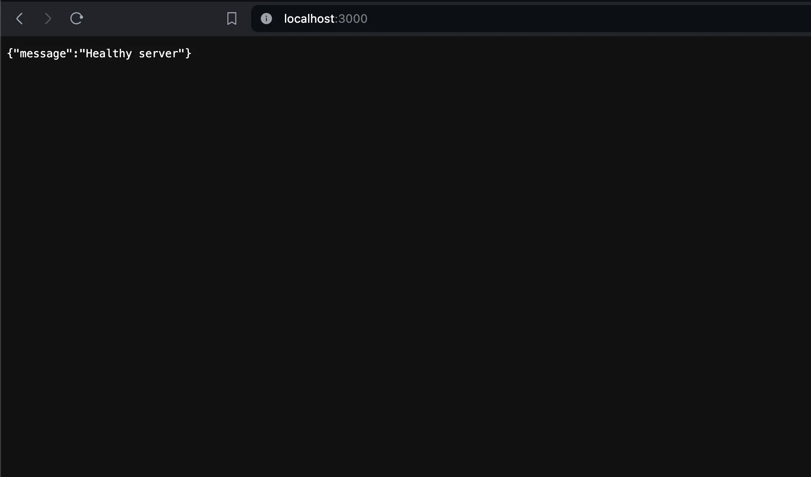

## Step 12 - Passing in env variables
```cmd
  docker run -p 3000:3000 -e DATABASE_URL="URL" image_name
```
- The -e argument let’s you send in environment variables to your node.js app

## Step 13 - More commands
1. docker kill - to kill a container
2. docker exec - to exectue a command inside a container
 
- Examples
1. List all contents of a container folder
```cmd
  docker exec <container_name_or_id> ls /path/to/directory
```

2. Running an Interactive Shell with the container
```cmd
  docker exec -it <container_name_or_id> /bin/bash
```

## Step 14 - Pushing to dockerhub
- Once you’ve created your image, you can push it to dockerhub to share it with the world.
  1. Signup to `dockerhub`
  2. Create a new repository

     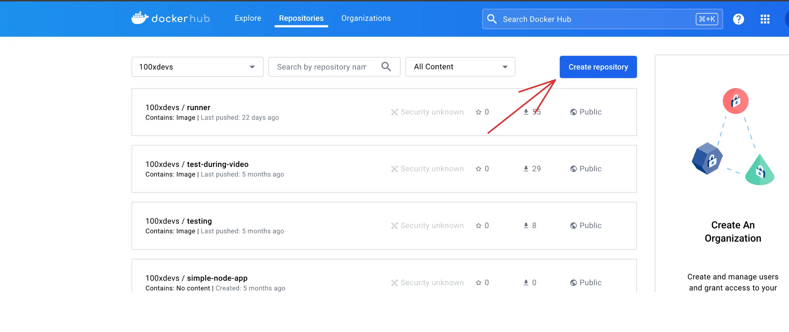

  3. Login to docker cli
     1. docker login
     2. you might have to create an access token - [Link to Access Token](https://docs.docker.com/security/for-developers/access-tokens/).
  
  4. Push to the repository
  ```cmd
    docker tag nodejs_project ramchan1/nodejs_project:latest
    docker push your_username/your_reponame:tagname
  ```

## Step 15 - Layers in Docker
- In Docker, layers are a fundamental part of the image architecture that allows Docker to be efficient, fast, and portable(optimizing).

- A Docker image is essentially built up from a series of layers, each representing a set of differences from the previous layer.

### How layers are made?
1. **Base Layer**: 
- The starting point of an image, typically an operating system (OS) like Ubuntu, Alpine, or any other base image specified in a Dockerfile.

2. **Instruction Layers**: 
- Each command in a Dockerfile creates a new layer in the image. 
- These include instructions like `RUN`, `COPY`, which modify the filesystem by installing packages, copying files from the host to the container, or making other changes. 
- Each of these modifications creates a new layer on top of the base layer.

3. **Reusable & Shareable**: 
- Layers are cached and reusable across different images, which makes building and sharing images more efficient.
- If multiple images are built from the same base image or share common instructions, they can reuse the same layers, reducing storage space and speeding up image downloads and builds.
- E.g. If the base image for NodeJS is installed, then for the other layers which we will be adding in the image will have the NodeJS image already. It will be cached as well.
- The build shows the number of layers in the docker file and the cached status also.

4. **Immutable**:
- Once a layer is created, it cannot be changed. 
- If a change is made, Docker creates a new layer that captures the difference.
- This immutability is key to Docker's reliability and performance, as unchanged layers can be shared across images and containers.

## Step 16 - Layers practically
- For a simple Node.js app - [Simple NodeJS Application](https://github.com/100xdevs-cohort-2/week-15-live-2)

### Dockerfile
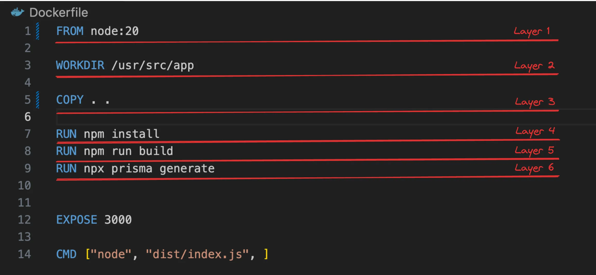 

### Logs
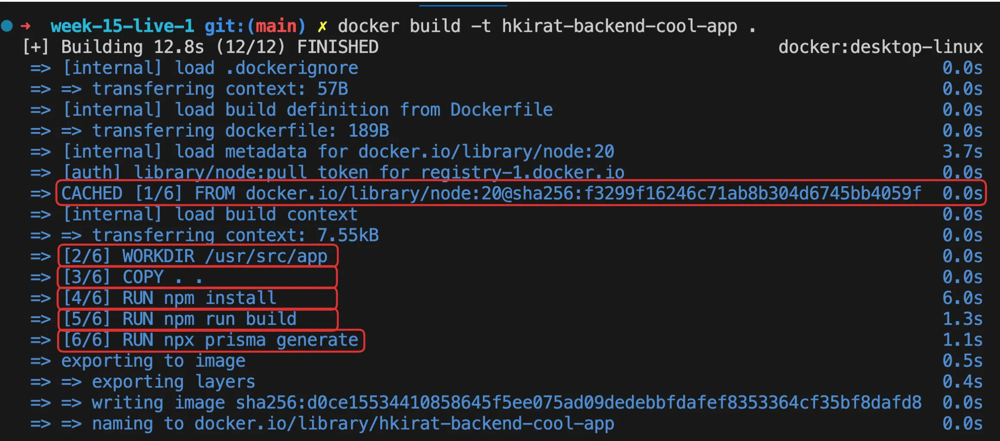

### Observations - 
1. Base image creates the first layer.
2. Each RUN, COPY , WORKDIR  command creates a new layer.
3. Layers can get re-used across docker builds (notice CACHED in 1/6).

## Step 17 - Why layers?
- If you change your Dockerfile, layers can get re-used based on where the change was made.
- 💡If a layer changes, all subsequent layers also change

### Case 1 - You change your source code
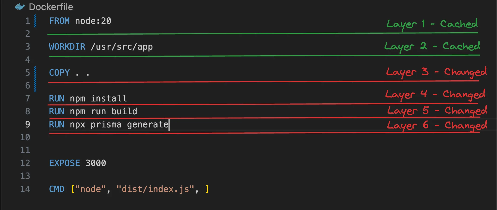

### Case 2 - You change the package.json file (added a dependency)


- Use case: we will be pushing the code to github, then github will push the image to dockerhub, docker will build the image and push it to the docker repository.
- We will write the CI/CD pipeline for it.

- The layer which has some change will change, and it will affect the layers above it to change.

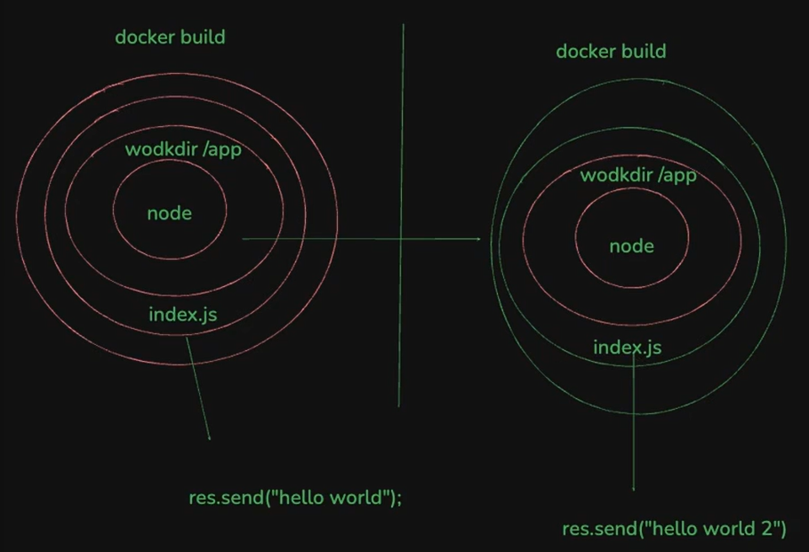

- If we do not make any change in the source code or package all the layers will be unchanged as all the layers will be cached.

## Step 18 - Optimising Dockerfile
- If we are not changing the package then `npm install` should be cached and it should not run again.
- The `npm install` should be cached, if the source code is changed.
- If the package is changed the `npm install` should not be cached.
- Solution is copying the package.json before the installation of the packages, then copy the rest of the files.
```docker
# Unoptimized Docker File
FROM node:22-alpine

WORKDIR /app

COPY . .

RUN npm install

EXPOSE 3000

CMD ["node", "index.js"]
```

```docker
# Optimized Docker File
FROM node:22-alpine

WORKDIR /app

COPY ./package.json ./package.json

RUN npm install

COPY . .

EXPOSE 3000

CMD ["node", "index.js"]
```

### What if we change the Dockerfile a bit?
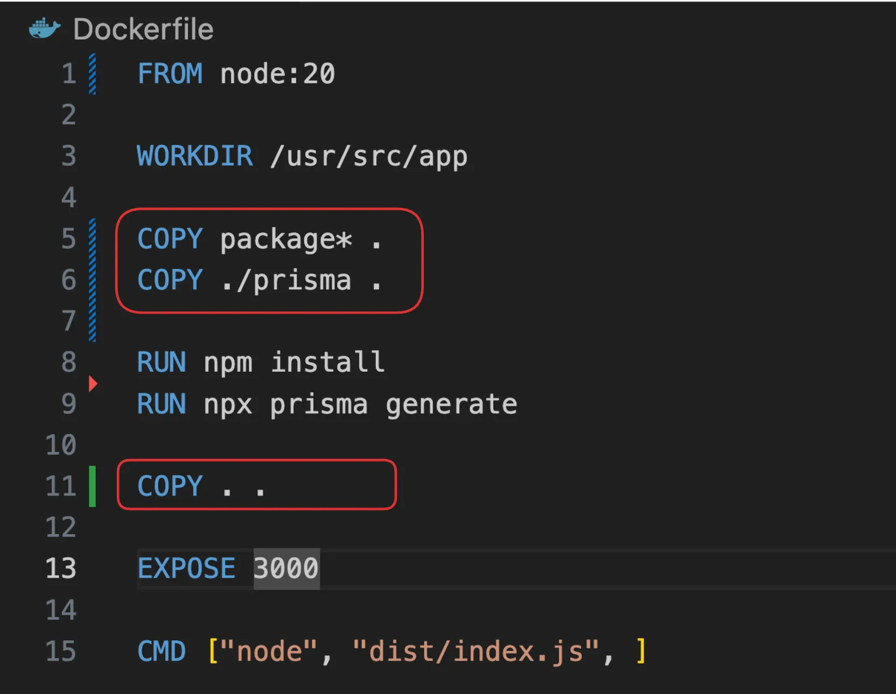

1. We first copy over only the things that npm install and npx prisma generate need.
2. Then we run these scripts.
3. Then we copy over the rest of the source code.


## Step 19 Networks and Volumes
- Networks and volumes are concepts that become important when you have multiple containers running in which you:
1. Need to persist data across docker restarts
2. Need to allow containers to talk to each other

- 💡We didn’t need networks until now because when we started the mongo container, it was being accessed by a Node.js process running directly on the machine.

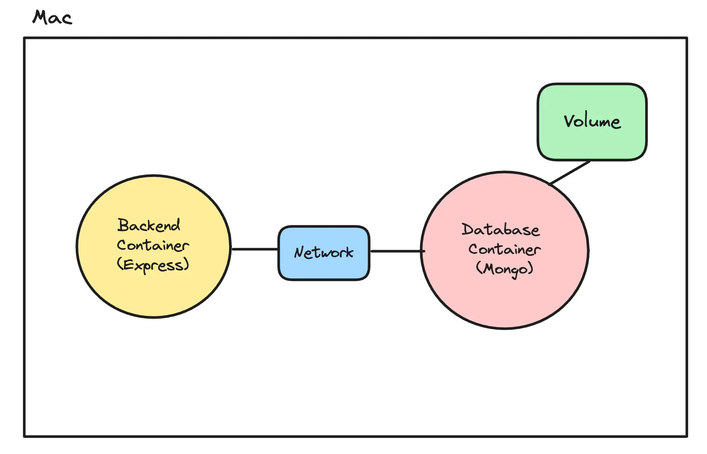

## Step 20 Volumes
- If you restart a `mongo` docker container, you will notice that your data goes away.
- This is because docker containers are transitory (they don’t retain data across restarts).

### Without volumes
1. Start a mongo container locally
```cmd
  docker run -p 27017:27017 -d mongo
```

2. Open it in MongoDB Compass and add some data to it

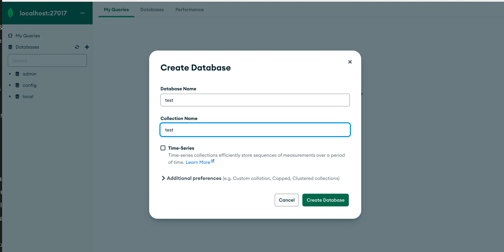

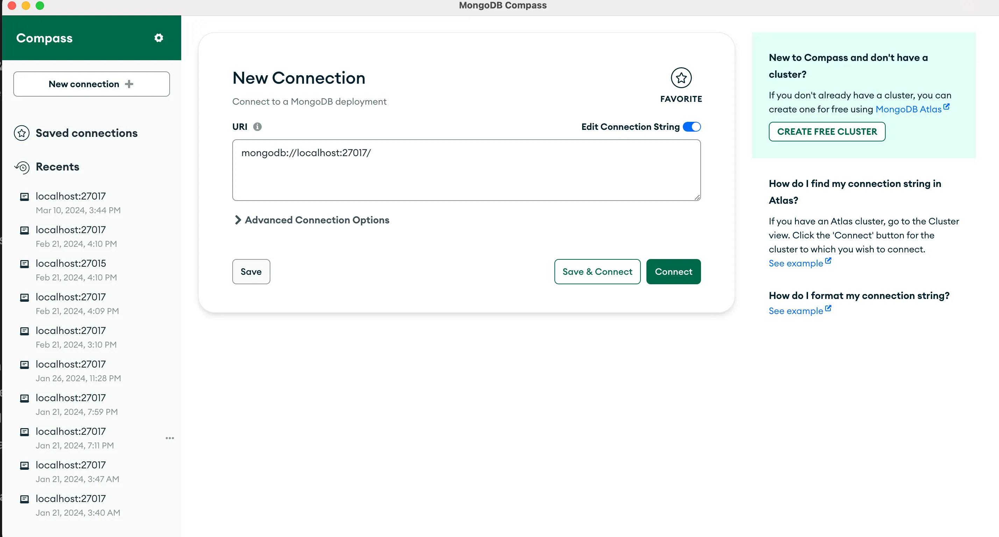

3. Kill the container
```cmd
  docker kill <container_id>
```

4. Restart the container
```cmd
  docker run -p 27017:27017 -d mongo
```

5. Try to explore the database in Compass and check if the data has persisted (it wouldn’t).

- We need to get the data which is dumped in the folder.

### With Volumes
1. Create a `volume`
```cmd
  docker volume create volume_database
```
- With this the Volume Box is created which is in `green`.


2. Mount the folder in `mongo` which actually stores the data to this volume
```cmd
  docker run -v volume_database:/data/db -p 27017:27017 mongo
```
- With this the green box in the container is created.
- It can be thought of like a database and a NodeJS process.
- The NodeJS process can close but the database will persist.

3. Open it in MongoDB Compass and add some data to it


4. Kill the container and check the volume(it exists)
```cmd
  docker kill <container_id>
  docker volume ls
```

5. Restart the container & mount the folder to the same volume.
```cmd
  docker run -v volume_database:/data/db -p 27017:27017 mongo
```

- Try to explore the database in Compass and check if the data has persisted (it will!)

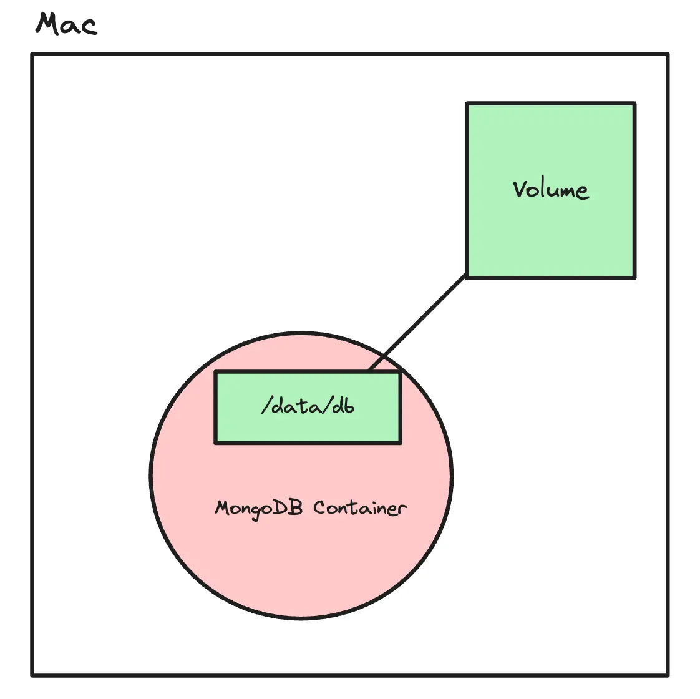

## Step 21 - Network
- If we run the docker container locally and run the NodeJS process, it will run fine.

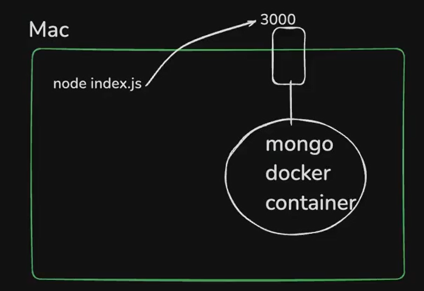

- Clone the project [Project Link](https://github.com/100xdevs-cohort-2/week-15-live-2.2.git)

- Then build the image in the Project directory using command:
```cmd
  docker build -t users-app .
```

- Then run the project using the command:
```cmd
  docker run -p 3000:3000 users-app
```

- This will not run because the containers will not be able to talk to each other.

- In Docker, a network is a powerful feature that allows containers to communicate with each other and with the outside world.

- Docker containers can’t talk to each other by default.

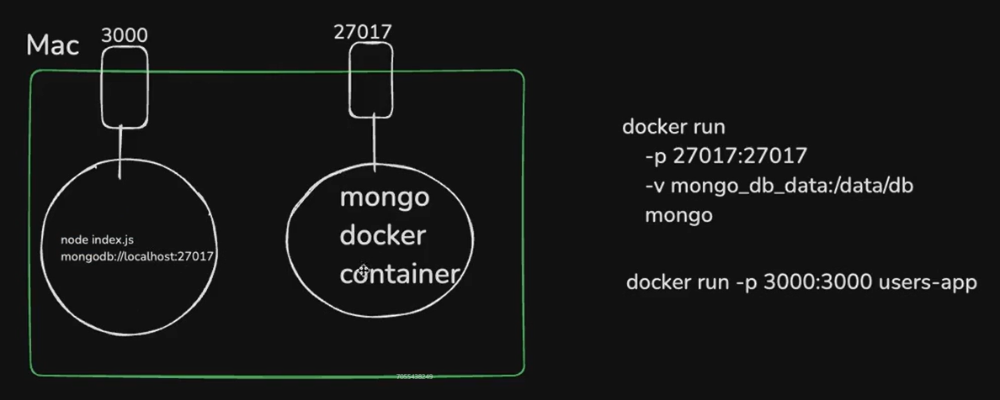

- We need to bridge the containers with the help of the networks.

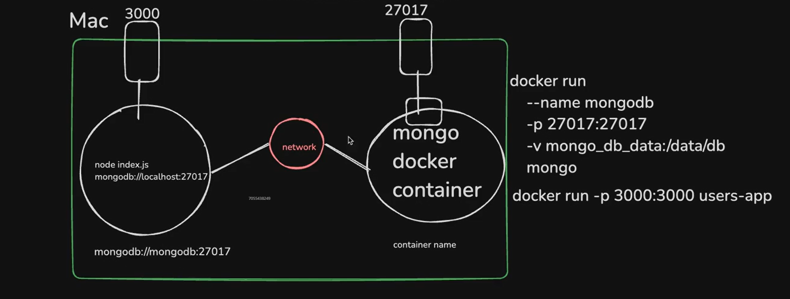

- The name of the container is changed to the mongodb this is why the name will be changed again to mongo in the src/db.ts file.

- `localhost` on a docker container means `it's own network` and not the network of the `host machine`.

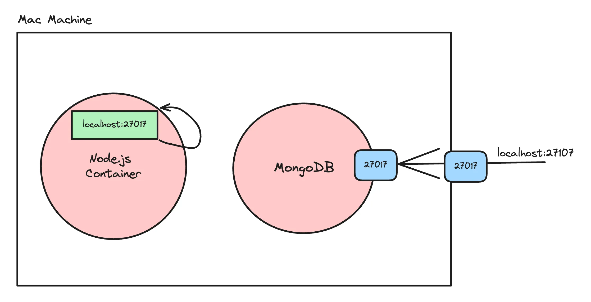

### How to make the containers talk to each other?
- Attach them to the same network.

1. Clone the repo - [Github Repo Link](https://github.com/100xdevs-cohort-2/week-15-live-2.2)

2. Build the image.
```cmd
  docker build -t image_tag .
```

3. Create a network and check the network.
```cmd
  docker network create my_custom_network
  docker network ls
```

4. Start mongo on the same network.
```cmd
  docker run --name mongodbcontainer --network node_app_network -p 27017:27017 -v mongo_db_data:/data/db mongo
```

5. Start the backend process with the network attached to it.
- Change the name in the database URL to which we are connecting in the MongoDB.
```cmd
  docker build -t users-app
```

- The again run the NodeJS container with the following command.
```cmd
  docker run --network node_app_network -p 3000:3000
```

6. Check the logs to ensure the db connection is successful.

7. Try to visit an endpoint and ensure you are able to talk to the database.
```cmd
  docker exec -it CONTAINER_ID sh 
  ping mongodbcontainer
```

8. If you want, you can remove the port mapping for mongo since you don’t necessarily need it exposed on your machine.

- Now the NodeJS Container will be able to connect to the MongoDB Container.

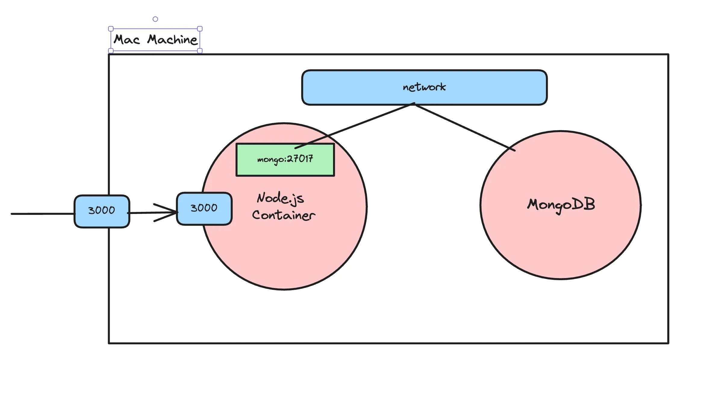

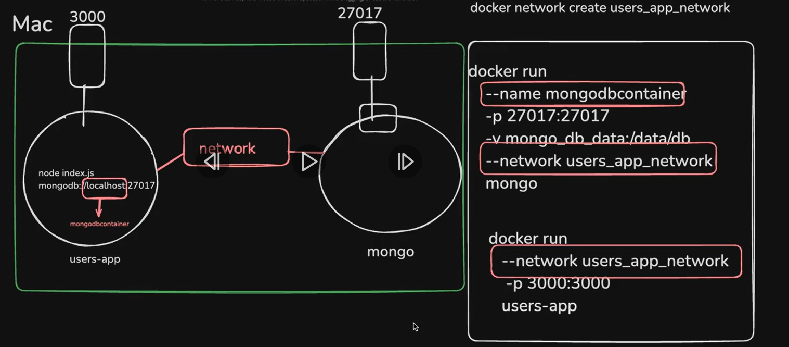

- We can remove the port number from the mongodb container as well.
- We create the Docker file for Backend and the mongodb runs differently in a different container we do not have to merge them together.
